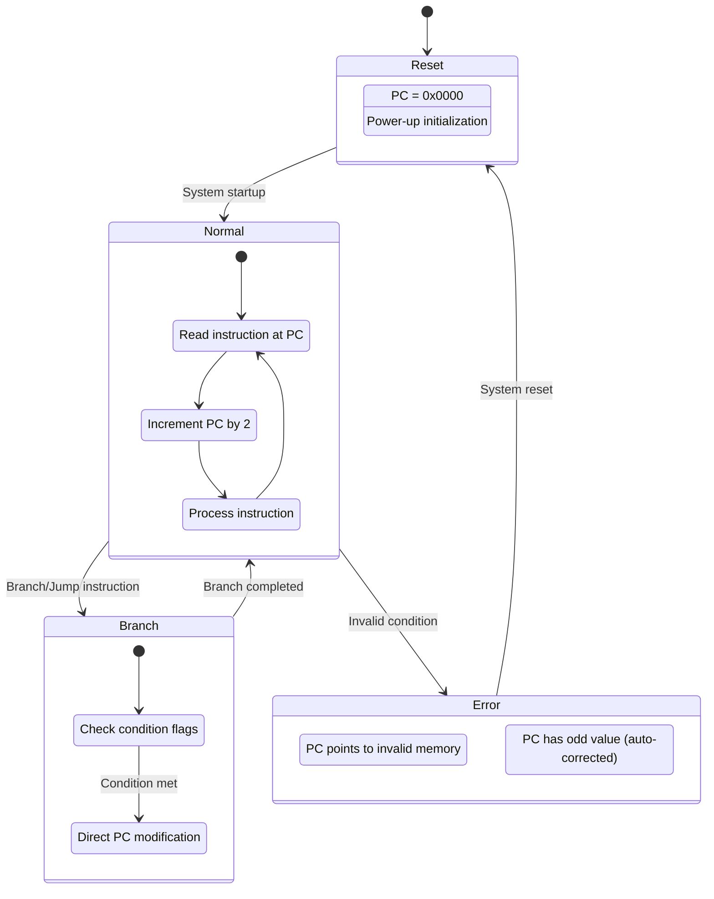
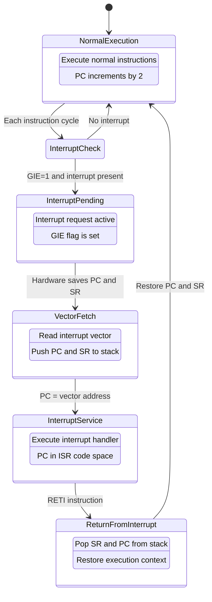
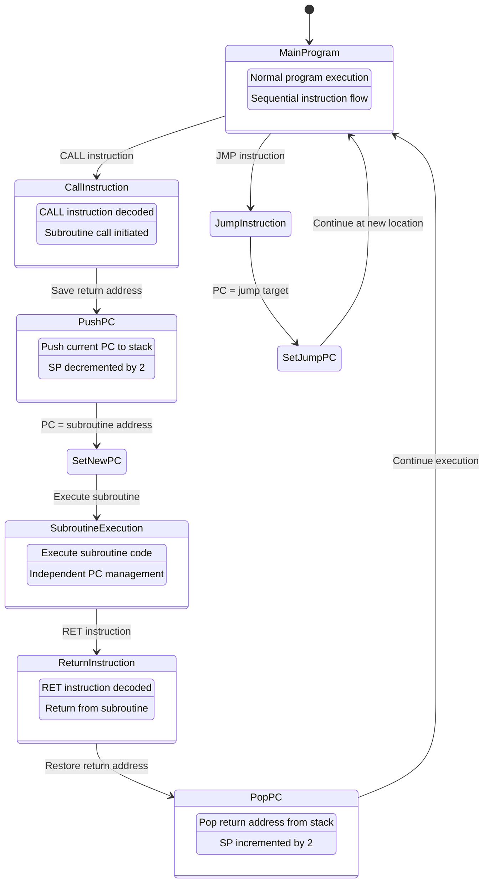

# MSP430 CPU Register Architecture Documentation

## Overview

The MSP430 CPU contains a 16-register file, where each register is 16 bits wide. This provides a total of 256 bits of register storage for the CPU. The register file includes four special-purpose registers and twelve general-purpose registers.

## Register File Organization

### MSP430 Register Layout

The MSP430 CPU contains 16 registers organized as follows:

#### Special Purpose Registers (R0-R3)

| Register | Name | Alias | Function |
|----------|------|-------|----------|
| R0 | PC | Program Counter | Points to next instruction |
| R1 | SP | Stack Pointer | Points to top of stack |
| R2 | SR | Status Register | CPU flags and control bits |
| R3 | CG1 | Constant Generator | Hardware constant generation |

#### General Purpose Registers (R4-R15)
```
┌─────────────────────────────────────────────────────────────────────────┐
│  R4    R5    R6    R7    R8    R9   R10   R11   R12   R13   R14   R15   │
│ ┌───┐ ┌───┐ ┌───┐ ┌───┐ ┌───┐ ┌───┐ ┌───┐ ┌───┐ ┌───┐ ┌───┐ ┌───┐ ┌───┐ │
│ │16b│ │16b│ │16b│ │16b│ │16b│ │16b│ │16b│ │16b│ │16b│ │16b│ │16b│ │16b│ │
│ └───┘ └───┘ └───┘ └───┘ └───┘ └───┘ └───┘ └───┘ └───┘ └───┘ └───┘ └───┘ │
└─────────────────────────────────────────────────────────────────────────┘
```

**Total Register File:** 16 registers × 16 bits = 256 bits of register storage

### Register Access Modes

Each register supports multiple access patterns:

#### Access Mode Summary
```
Register (R0-R15) supports:
├── 16-bit Full Access
│   ├── Read entire 16-bit value
│   └── Write entire 16-bit value
├── 8-bit Low Byte Access (Bits 0-7)
│   ├── Read lower 8 bits only
│   └── Write lower 8 bits only
└── 8-bit High Byte Access (Bits 8-15)
    ├── Read upper 8 bits only
    └── Write upper 8 bits only
```

#### Access Pattern Details
| Access Type | Bit Range | Operation | Usage |
|-------------|-----------|-----------|-------|
| 16-bit Full | 15-0 | Read/Write complete register | Standard operations |
| 8-bit Low   | 7-0  | Read/Write lower byte only | Byte-oriented operations |
| 8-bit High  | 15-8 | Read/Write upper byte only | Byte-oriented operations |

### Individual Register Structure

Each MSP430 register is organized as a 16-bit word:

#### Bit Organization
```
MSP430 Register (16-bit):
┌───┬───┬───┬───┬───┬───┬───┬───┬───┬───┬───┬───┬───┬───┬───┬───┐
│15 │14 │13 │12 │11 │10 │ 9 │ 8 │ 7 │ 6 │ 5 │ 4 │ 3 │ 2 │ 1 │ 0 │
├───┴───┴───┴───┴───┴───┴───┴───┼───┴───┴───┴───┴───┴───┴───┴───┤
│        High Byte (15-8)       │        Low Byte (7-0)        │
└───────────────────────────────┴───────────────────────────────┘
```

#### Byte Access Mapping
- **High Byte Access**: Reads/writes bits 15-8 (upper portion)
- **Low Byte Access**: Reads/writes bits 7-0 (lower portion)
- **Full Access**: Reads/writes all 16 bits simultaneously

#### Bit Significance
- **MSB (Most Significant Bit)**: Bit 15
- **LSB (Least Significant Bit)**: Bit 0
- **Word Boundary**: All registers aligned on 16-bit boundaries

### Register Function Legend
- **🔴 Program Counter**: Word-aligned addressing for instruction fetch
- **🔵 Stack Pointer**: Word-aligned, handles stack operations  
- **🟢 Status Register**: Individual flag management and system control
- **🟡 Constant Generator**: Hardware constant generation (0, +1, +2, +4, +8, -1)
- **⚪ General Purpose**: Standard read/write operations for program data

## Status Register (SR/R2) Bit Layout

The Status Register contains CPU flags and system control bits that affect processor operation.

### Status Register Bit Organization

The Status Register is organized into functional groups with specific bit assignments:

```
Status Register (R2) - 16-bit Layout:
┌───┬───┬───┬───┬───┬───┬───┬───┬───┬───┬───┬───┬───┬───┬───┬───┐
│15 │14 │13 │12 │11 │10 │ 9 │ 8 │ 7 │ 6 │ 5 │ 4 │ 3 │ 2 │ 1 │ 0 │
├───┼───┼───┼───┼───┼───┼───┼───┼───┼───┼───┼───┼───┼───┼───┼───┤
│ R │ R │ R │ R │ R │ R │ R │ V │SCG│SCG│OSC│CPU│GIE│ N │ Z │ C │
│ E │ E │ E │ E │ E │ E │ E │   │ 1 │ 0 │OFF│OFF│   │   │   │   │
│ S │ S │ S │ S │ S │ S │ S │   │   │   │   │   │   │   │   │   │
│ E │ E │ E │ E │ E │ E │ E │   │   │   │   │   │   │   │   │   │
│ R │ R │ R │ R │ R │ R │ R │   │   │   │   │   │   │   │   │   │
│ V │ V │ V │ V │ V │ V │ V │   │   │   │   │   │   │   │   │   │
│ E │ E │ E │ E │ E │ E │ E │   │   │   │   │   │   │   │   │   │
│ D │ D │ D │ D │ D │ D │ D │   │   │   │   │   │   │   │   │   │
└───┴───┴───┴───┴───┴───┴───┴───┴───┴───┴───┴───┴───┴───┴───┴───┘
```

### Functional Groupings

#### Reserved Bits (15-9) ⚪
- **Purpose**: Unused by hardware
- **Software Use**: Should be written as 0, ignored on read
- **Count**: 7 bits reserved for future expansion

#### Arithmetic Flags (8, 2-0) 🔴🟣  
- **V (Bit 8)**: Overflow Flag - signed arithmetic overflow detection
- **N (Bit 2)**: Negative Flag - result sign indication  
- **Z (Bit 1)**: Zero Flag - zero result detection
- **C (Bit 0)**: Carry Flag - arithmetic carry/borrow indication

#### System Control (7-3) 🟡🔵🟢
- **SCG1 (Bit 7)**: System Clock Generator 1 control
- **SCG0 (Bit 6)**: System Clock Generator 0 control  
- **OSCOFF (Bit 5)**: Oscillator control
- **CPUOFF (Bit 4)**: CPU power control
- **GIE (Bit 3)**: Global Interrupt Enable

### Detailed Bit Assignments

| Bit | Name | Function | Flag Color |
|-----|------|----------|------------|
| 15-9 | Reserved | Unused bits | ⚪ |
| 8 | V | Overflow Flag | 🔴 |
| 7 | SCG1 | System Clock Generator 1 | 🟡 |
| 6 | SCG0 | System Clock Generator 0 | 🟡 |
| 5 | OSCOFF | Oscillator Off | 🔵 |
| 4 | CPUOFF | CPU Off | 🔵 |
| 3 | GIE | Global Interrupt Enable | 🟢 |
| 2 | N | Negative Flag | 🟣 |
| 1 | Z | Zero Flag | 🟣 |
| 0 | C | Carry Flag | 🟣 |

### Condition Code Flags (Bits 0-2) 🟣

The condition code flags are updated by arithmetic and logical operations:

#### Carry Flag (C - Bit 0)
- **Set When**: Arithmetic operation produces carry out or borrow in
- **Usage**: Multi-precision arithmetic, unsigned comparison results
- **Instructions**: ADD, SUB, CMP operations and their variants

#### Zero Flag (Z - Bit 1)  
- **Set When**: Result of operation equals zero
- **Usage**: Conditional branches, equality testing
- **Instructions**: Any operation that produces a zero result

#### Negative Flag (N - Bit 2)
- **Set When**: Result has MSB set (negative in two's complement)
- **Usage**: Signed comparisons, conditional branches
- **Instructions**: Operations that affect the sign bit

#### Flag Combinations

| Carry (C) | Zero (Z) | Negative (N) | Result Description |
|-----------|----------|--------------|-------------------|
| 0 | 0 | 0 | Positive result, no carry |
| 0 | 0 | 1 | Negative result |
| 0 | 1 | 0 | Zero result |
| 0 | 1 | 1 | Zero result with negative flag (rare) |
| 1 | 0 | 0 | Positive result with carry |
| 1 | 0 | 1 | Negative result with carry |
| 1 | 1 | 0 | Zero result with carry |
| 1 | 1 | 1 | Zero result with carry and negative (rare) |

### System Control Flags

The system control flags manage CPU operation modes and interrupt handling:

#### Global Interrupt Enable (GIE - Bit 3) 🟢
- **Function**: Enables/disables maskable interrupts
- **Set By**: Software (BIS instruction) or RETI instruction
- **Cleared By**: Hardware on interrupt acceptance or software (BIC instruction)
- **Usage**: Interrupt system control

#### CPU Power Control (CPUOFF - Bit 4) 🔵  
- **Function**: Disables CPU core while leaving peripherals active
- **Power Mode**: LPM0 and higher low power modes
- **Wake**: Any enabled interrupt or reset
- **Usage**: Power management, LPM0-LPM4 modes

#### Oscillator Control (OSCOFF - Bit 5) 🔵
- **Function**: Turns off LFXT1 crystal oscillator  
- **Power Mode**: LPM4 mode
- **Effect**: Disables low-frequency clock source
- **Usage**: Maximum power savings

#### System Clock Generator 0 (SCG0 - Bit 6) 🟡
- **Function**: Turns off SMCLK (sub-main clock)
- **Power Mode**: LPM1 and higher modes
- **Effect**: Disables sub-main clock to peripherals
- **Usage**: Intermediate power savings

#### System Clock Generator 1 (SCG1 - Bit 7) 🟡  
- **Function**: Turns off DCO (digitally controlled oscillator)
- **Power Mode**: LPM3 and higher modes
- **Effect**: Disables high-frequency clock source
- **Usage**: Significant power savings

#### Overflow Flag (V - Bit 8) 🔴
- **Function**: Indicates signed arithmetic overflow
- **Set When**: Two's complement overflow occurs
- **Usage**: Signed arithmetic validation
- **Instructions**: ADD, SUB operations on signed values

#### Power Mode Combinations

| Mode | CPUOFF | SCG0 | SCG1 | OSCOFF | Description |
|------|---------|-------|-------|---------|-------------|
| LPM0 | 1 | 0 | 0 | 0 | CPU off, all clocks active |
| LPM1 | 1 | 1 | 0 | 0 | CPU off, SMCLK off |
| LPM2 | 1 | 0 | 1 | 0 | CPU off, DCO off |
| LPM3 | 1 | 1 | 1 | 0 | CPU off, SMCLK and DCO off |
| LPM4 | 1 | 1 | 1 | 1 | CPU off, all clocks off |

### Status Register Flag Usage

| Flag Category | Usage | Updated By |
|---------------|-------|------------|
| 🟣 Condition Codes | Updated by arithmetic/logical operations | ALU operations |
| 🔴 Overflow Flag | Updated by signed arithmetic operations | Signed ALU operations |
| 🟢 Interrupt Control | Controls interrupt processing | Software/Hardware |
| 🔵 Power Management | Controls low power modes | Software |
| 🟡 Clock Control | Controls system clocks | Software |
| ⚪ Reserved | Should not be used | N/A |

## Program Counter (PC/R0) State Management

The Program Counter controls instruction execution flow and has several operational states.

### PC State Summary

The PC operates in distinct states with specific transition conditions:

#### State Overview
```
PC State Management:
├── Reset State
│   ├── Condition: System startup/reset
│   ├── PC Value: 0x0000 (initial)
│   └── Transition: → Normal State
├── Normal Execution State  
│   ├── Operations: Fetch → Decode → Execute cycle
│   ├── PC Behavior: Auto-increment by 2 per instruction
│   └── Transitions: → Branch State | → Interrupt State | → Error State
├── Branch/Jump State
│   ├── Triggers: Branch/Jump instructions
│   ├── PC Behavior: Set to target address (word-aligned)
│   └── Transition: → Normal State
├── Interrupt State
│   ├── Triggers: Interrupt request with GIE=1
│   ├── PC Behavior: Save current PC, load interrupt vector
│   └── Transition: → Normal State (via RETI)
└── Error State
    ├── Triggers: Invalid address, misalignment
    ├── PC Behavior: Error handling/auto-correction
    └── Transition: → Reset State | → Normal State
```

### Basic PC Operation States



### Interrupt Handling States

#### Interrupt Processing Flow
```
Interrupt Handling Sequence:
1. Normal Execution
   ├── Check: GIE flag status each instruction cycle
   ├── If GIE=0: Continue normal execution
   └── If GIE=1: Check for pending interrupts

2. Interrupt Detection  
   ├── Condition: Interrupt request + GIE=1
   ├── Action: Hardware saves context
   └── Next: Vector fetch

3. Context Save
   ├── Push current PC to stack (SP -= 2)
   ├── Push current SR to stack (SP -= 2)  
   ├── Clear GIE flag (disable interrupts)
   └── Next: Load interrupt vector

4. Vector Processing
   ├── Read interrupt vector address
   ├── Set PC = vector address
   ├── Begin interrupt service routine
   └── Next: Execute ISR

5. Service Routine Execution
   ├── Execute interrupt handler code
   ├── PC operates normally within ISR
   └── Wait for: RETI instruction

6. Return from Interrupt
   ├── RETI instruction executed
   ├── Pop SR from stack (SP += 2, restore GIE)
   ├── Pop PC from stack (SP += 2)
   └── Resume: Normal execution at saved PC
```



### Subroutine Call States

#### Call/Return Flow Sequence
```
Subroutine Management:

CALL Instruction Flow:
1. Main Program Execution
   ├── Executing sequential instructions
   ├── PC increments normally by 2
   └── Encounters CALL instruction

2. Call Processing
   ├── Save return address: Push PC to stack (SP -= 2)
   ├── Set PC = subroutine address (word-aligned)
   └── Begin subroutine execution

3. Subroutine Execution  
   ├── Execute subroutine instructions
   ├── PC operates independently in subroutine space
   └── Can make nested calls (recursive)

4. Return Processing (RET instruction)
   ├── Pop return address from stack (SP += 2)
   ├── Set PC = return address
   └── Resume main program execution

JMP Instruction Flow:
1. Main Program Execution
   └── Encounters JMP instruction

2. Jump Processing
   ├── Set PC = jump target address (word-aligned)
   ├── No return address saved
   └── Continue execution at new location

Stack Frame Management:
├── CALL: SP decreases (push return address)
├── RET:  SP increases (pop return address)
├── Nested calls: Multiple stack entries
└── Stack overflow: Potential error condition
```



### PC Alignment and Addressing Rules

#### PC Alignment Rules
- **Always word-aligned**: PC must point to even addresses
- **Odd addresses**: Automatically rounded down to maintain alignment
- **Instruction fetch**: Always increments PC by 2 (word boundary)

#### Branch Target Rules
- **Branch offset**: Must be word-aligned
- **Jump targets**: Must be even addresses
- **Invalid addresses**: Cause undefined behavior

#### Interrupt Vector Rules
- **Vector storage**: Located in high memory (0xFFE0-0xFFFF)
- **Vector size**: Each vector is 2 bytes (word-aligned)
- **Hardware behavior**: Automatically pushes PC and SR to stack

#### PC Modification Rules
- **Direct writes**: Writing to R0 directly affects PC
- **Stack operations**: May indirectly affect PC through subroutine calls/returns
- **Address calculations**: PC-relative addressing preserves alignment

## Register File Operations

### Common Operations

```csharp
var registerFile = new RegisterFile(logger);

// Basic register operations
registerFile.WriteRegister(RegisterName.R4, 0x1234);
ushort value = registerFile.ReadRegister(RegisterName.R4);

// Special register access
registerFile.SetProgramCounter(0x8000);
registerFile.IncrementProgramCounter(); // Auto-aligned to 0x8002

// Status register flag management
registerFile.StatusRegister.Carry = true;
registerFile.StatusRegister.Zero = true;
Console.WriteLine(registerFile.StatusRegister); // "SR: 0x0003 [C, Z]"

// 8-bit access modes
registerFile.WriteRegisterLowByte(RegisterName.R5, 0xAB);
byte lowByte = registerFile.ReadRegisterLowByte(RegisterName.R5);
```

### Register Access Patterns

| Access Type | Description | Usage |
|-------------|-------------|-------|
| 16-bit Read/Write | Full register access | Standard operations |
| 8-bit Low Byte | Access bits 0-7 | Byte operations |
| 8-bit High Byte | Access bits 8-15 | Byte operations |
| Special Register Methods | PC, SP, SR specific operations | System control |

## Implementation Notes

### Special Register Behaviors

1. **Program Counter (R0)**
   - Maintains word alignment automatically
   - Points to the next instruction to execute
   - Modified by branches, jumps, calls, and returns

2. **Stack Pointer (R1)**
   - Maintains word alignment for stack operations
   - Decremented before PUSH, incremented after POP
   - Points to the top of the stack

3. **Status Register (R2)**
   - Individual flag access methods provided
   - Flags updated by arithmetic and logical operations
   - Controls interrupt processing and power management

4. **Constant Generator (R3)**
   - Provides hardware-generated constants
   - Values: 0, +1, +2, +4, +8, -1
   - Read-only in normal operation

### Validation and Error Handling

The register file implementation includes comprehensive validation:
- Range checking for register numbers
- Value validation for special registers
- Proper error messages with context
- Logging integration for debugging

All register operations are logged with appropriate detail levels for system debugging and monitoring.