# MSP430 CPU Register Architecture Documentation

## Overview

The MSP430 CPU contains a 16-register file, where each register is 16 bits wide. This provides a total of 256 bits of register storage for the CPU. The register file includes four special-purpose registers and twelve general-purpose registers.

## Register File Organization

```mermaid
graph TB
    subgraph regfile["MSP430 Register File (16 x 16-bit Registers)"]
        subgraph special["Special Purpose Registers"]
            R0["R0 (PC)<br/>Program Counter<br/>🔴 Word-aligned"]
            R1["R1 (SP)<br/>Stack Pointer<br/>🔵 Word-aligned"]
            R2["R2 (SR)<br/>Status Register<br/>🟢 CPU flags"]
            R3["R3 (CG1)<br/>Constant Generator<br/>🟡 Hardware constants"]
        end
        
        subgraph general["General Purpose Registers"]
            R4["R4<br/>General Purpose"]
            R5["R5<br/>General Purpose"]
            R6["R6<br/>General Purpose"]
            R7["R7<br/>General Purpose"]
            R8["R8<br/>General Purpose"]
            R9["R9<br/>General Purpose"]
            R10["R10<br/>General Purpose"]
            R11["R11<br/>General Purpose"]
            R12["R12<br/>General Purpose"]
            R13["R13<br/>General Purpose"]
            R14["R14<br/>General Purpose"]
            R15["R15<br/>General Purpose"]
        end
    end
    
    subgraph access["Register Access Modes"]
        ACCESS16["16-bit Access<br/>Read/Write full register"]
        ACCESS8L["8-bit Low Byte Access<br/>Bits 0-7"]
        ACCESS8H["8-bit High Byte Access<br/>Bits 8-15"]
    end
    
    special --> access
    general --> access
    
    subgraph structure["Register Structure (Each Register)"]
        direction LR
        B15["Bit 15"] --> B14["Bit 14"] --> BDOTS["..."] --> B1["Bit 1"] --> B0["Bit 0"]
    end
```



### Register Color Legend
- 🔴 **Program Counter**: Word-aligned addressing
- 🔵 **Stack Pointer**: Word-aligned, stack operations  
- 🟢 **Status Register**: Individual flag management
- 🟡 **Constant Generator**: Hardware constant generation
- ⚪ **General Purpose**: Standard read/write operations

## Status Register (SR/R2) Bit Layout

The Status Register contains CPU flags and system control bits that affect processor operation.

```mermaid
graph LR
    subgraph sr["Status Register (R2/SR) - 16 bits"]
        direction LR
        B15["15<br/>Reserved"] --> B14["14<br/>Reserved"] --> B13["13<br/>Reserved"] --> B12["12<br/>Reserved"]
        B12 --> B11["11<br/>Reserved"] --> B10["10<br/>Reserved"] --> B9["9<br/>Reserved"] --> B8["8<br/>V<br/>🔴"]
        B8 --> B7["7<br/>SCG1<br/>🟡"] --> B6["6<br/>SCG0<br/>🟡"] --> B5["5<br/>OSCOFF<br/>🔵"]
        B5 --> B4["4<br/>CPUOFF<br/>🔵"] --> B3["3<br/>GIE<br/>🟢"] --> B2["2<br/>N<br/>🟣"] --> B1["1<br/>Z<br/>🟣"] --> B0["0<br/>C<br/>🟣"]
    end
    
    subgraph flags["Flag Categories"]
        subgraph cc["Condition Code Flags 🟣"]
            CFLAG["C (Bit 0): Carry Flag<br/>Set on arithmetic carry/borrow"]
            ZFLAG["Z (Bit 1): Zero Flag<br/>Set when result equals zero"]
            NFLAG["N (Bit 2): Negative Flag<br/>Set when result is negative"]
        end
        
        subgraph overflow["Overflow Flag 🔴"]
            VFLAG["V (Bit 8): Overflow Flag<br/>Set on signed arithmetic overflow"]
        end
        
        subgraph sys["System Control Flags 🟢"]
            GIEFLAG["GIE (Bit 3): Global Interrupt Enable<br/>Enables maskable interrupts"]
        end
        
        subgraph power["Power Management Flags 🔵"]
            CPUOFFFLAG["CPUOFF (Bit 4): CPU Off<br/>Turns off CPU (LPM0+)"]
            OSCOFFFLAG["OSCOFF (Bit 5): Oscillator Off<br/>Turns off LFXT1 oscillator"]
        end
        
        subgraph clock["Clock Control Flags 🟡"]
            SCG0FLAG["SCG0 (Bit 6): System Clock Generator 0<br/>Turns off SMCLK"]
            SCG1FLAG["SCG1 (Bit 7): System Clock Generator 1<br/>Turns off DCO"]
        end
        
        subgraph reserved["Reserved Bits ⚪"]
            RESERVED["Bits 9-15: Reserved<br/>Should be written as 0<br/>Read as undefined"]
        end
    end
```



### Status Register Flag Usage

| Flag Category | Usage | Updated By |
|---------------|-------|------------|
| 🟣 Condition Codes | Updated by arithmetic/logical operations | ALU operations |
| 🔴 Overflow Flag | Updated by signed arithmetic operations | Signed ALU operations |
| 🟢 Interrupt Control | Controls interrupt processing | Software/Hardware |
| 🔵 Power Management | Controls low power modes | Software |
| 🟡 Clock Control | Controls system clocks | Software |
| ⚪ Reserved | Should not be used | N/A |

## Program Counter (PC/R0) State Machine

The Program Counter controls instruction execution flow and has several operational states.

```mermaid
stateDiagram-v2
    [*] --> Reset
    
    state Reset {
        [*] --> PC_Reset
        PC_Reset : PC = 0x0000
        PC_Reset : Power-up state
    }
    
    state Normal {
        [*] --> Fetch
        Fetch --> Decode : Increment PC (+2)
        Decode --> Execute : Instruction ready
        Execute --> Fetch : Next instruction
        
        Fetch : PC points to instruction
        Fetch : Read instruction from memory
        Decode : PC incremented by 2
        Decode : Instruction decoded
        Execute : Execute instruction
        Execute : May modify PC
    }
    
    state Branch {
        [*] --> CondBranch
        CondBranch : Branch if condition met
        CondBranch : PC = PC + offset
        
        state UncondJump {
            UncondJump : Always jump
            UncondJump : PC = new address
        }
        
        state Call {
            Call : Push PC to stack
            Call : PC = subroutine address
        }
        
        state Return {
            Return : Pop PC from stack
            Return : Restore saved PC
        }
    }
    
    state Interrupt {
        [*] --> IRQ
        IRQ --> Vector : GIE = 1, interrupt pending
        Vector --> ISR : PC = vector address
        ISR --> RETI : Execute handler
        RETI --> [*] : Restore PC and SR
        
        IRQ : Interrupt pending
        IRQ : GIE flag checked
        Vector : Read interrupt vector
        Vector : PC = vector address
        ISR : Execute interrupt handler
        ISR : PC in ISR code
        RETI : Return from interrupt
        RETI : Restore PC and SR
    }
    
    state Special {
        [*] --> Stack
        Stack : PUSH/POP instructions
        Stack : May affect PC indirectly
        
        state RegOps {
            RegOps : Direct PC modification
            RegOps : MOV #value, PC
        }
        
        state AddrCalc {
            AddrCalc : PC-relative addressing
            AddrCalc : PC + offset calculations
        }
    }
    
    state Error {
        [*] --> Invalid
        Invalid : PC points to invalid memory
        Invalid : Access violation
        
        state Misalign {
            Misalign : PC has odd value
            Misalign : Automatic alignment
        }
        
        state StackErr {
            StackErr : Stack pointer corruption
            StackErr : PC restoration fails
        }
    }
    
    Reset --> Normal : System startup
    Normal --> Branch : Branch/Jump instruction
    Branch --> Normal : Branch completed
    Normal --> Interrupt : Interrupt occurs
    Interrupt --> Normal : Return from interrupt (RETI)
    Normal --> Special : Special instruction
    Special --> Normal : Operation complete
    
    Normal --> Error : Error condition detected
    Branch --> Error : Invalid branch target
    Interrupt --> Error : Vector table corruption
    Special --> Error : Invalid PC value
    Error --> Reset : System reset required
```

### PC Alignment and Addressing Rules

#### PC Alignment Rules
- **Always word-aligned**: PC must point to even addresses
- **Odd addresses**: Automatically rounded down to maintain alignment
- **Instruction fetch**: Always increments PC by 2 (word boundary)

#### Branch Target Rules
- **Branch offset**: Must be word-aligned
- **Jump targets**: Must be even addresses
- **Invalid addresses**: Cause undefined behavior

#### Interrupt Vector Rules
- **Vector storage**: Located in high memory (0xFFE0-0xFFFF)
- **Vector size**: Each vector is 2 bytes (word-aligned)
- **Hardware behavior**: Automatically pushes PC and SR to stack

#### PC Modification Rules
- **Direct writes**: Writing to R0 directly affects PC
- **Stack operations**: May indirectly affect PC through subroutine calls/returns
- **Address calculations**: PC-relative addressing preserves alignment

## Register File Operations

### Common Operations

```csharp
var registerFile = new RegisterFile(logger);

// Basic register operations
registerFile.WriteRegister(RegisterName.R4, 0x1234);
ushort value = registerFile.ReadRegister(RegisterName.R4);

// Special register access
registerFile.SetProgramCounter(0x8000);
registerFile.IncrementProgramCounter(); // Auto-aligned to 0x8002

// Status register flag management
registerFile.StatusRegister.Carry = true;
registerFile.StatusRegister.Zero = true;
Console.WriteLine(registerFile.StatusRegister); // "SR: 0x0003 [C, Z]"

// 8-bit access modes
registerFile.WriteRegisterLowByte(RegisterName.R5, 0xAB);
byte lowByte = registerFile.ReadRegisterLowByte(RegisterName.R5);
```

### Register Access Patterns

| Access Type | Description | Usage |
|-------------|-------------|-------|
| 16-bit Read/Write | Full register access | Standard operations |
| 8-bit Low Byte | Access bits 0-7 | Byte operations |
| 8-bit High Byte | Access bits 8-15 | Byte operations |
| Special Register Methods | PC, SP, SR specific operations | System control |

## Implementation Notes

### Special Register Behaviors

1. **Program Counter (R0)**
   - Maintains word alignment automatically
   - Points to the next instruction to execute
   - Modified by branches, jumps, calls, and returns

2. **Stack Pointer (R1)**
   - Maintains word alignment for stack operations
   - Decremented before PUSH, incremented after POP
   - Points to the top of the stack

3. **Status Register (R2)**
   - Individual flag access methods provided
   - Flags updated by arithmetic and logical operations
   - Controls interrupt processing and power management

4. **Constant Generator (R3)**
   - Provides hardware-generated constants
   - Values: 0, +1, +2, +4, +8, -1
   - Read-only in normal operation

### Validation and Error Handling

The register file implementation includes comprehensive validation:
- Range checking for register numbers
- Value validation for special registers
- Proper error messages with context
- Logging integration for debugging

All register operations are logged with appropriate detail levels for system debugging and monitoring.