# MSP430 CPU Register Architecture Documentation

## Overview

The MSP430 CPU contains a 16-register file, where each register is 16 bits wide. This provides a total of 256 bits of register storage for the CPU. The register file includes four special-purpose registers and twelve general-purpose registers.

## Register File Organization

### MSP430 Register Layout

```mermaid
graph LR
    subgraph special["Special Purpose Registers"]
        direction LR
        R0["R0 - PC<br/>Program Counter<br/>🔴"] 
        R1["R1 - SP<br/>Stack Pointer<br/>🔵"]
        R2["R2 - SR<br/>Status Register<br/>🟢"] 
        R3["R3 - CG1<br/>Constant Generator<br/>🟡"]
        R0 --- R1
        R1 --- R2 
        R2 --- R3
    end
    
    subgraph general["General Purpose Registers"]
        direction LR
        R4["R4"] --- R5["R5"] --- R6["R6"] --- R7["R7"]
        R8["R8"] --- R9["R9"] --- R10["R10"] --- R11["R11"] 
        R12["R12"] --- R13["R13"] --- R14["R14"] --- R15["R15"]
    end
    
    special --- general
```



### Register Access Modes


### Individual Register Structure


### Register Color Legend
- 🔴 **Program Counter**: Word-aligned addressing
- 🔵 **Stack Pointer**: Word-aligned, stack operations  
- 🟢 **Status Register**: Individual flag management
- 🟡 **Constant Generator**: Hardware constant generation
- ⚪ **General Purpose**: Standard read/write operations

## Status Register (SR/R2) Bit Layout

The Status Register contains CPU flags and system control bits that affect processor operation.

### Status Register Bit Map

The Status Register is organized into functional groups:

```mermaid
graph LR
    subgraph sr["Status Register Layout (MSB → LSB)"]
        direction LR
        RESERVED["Bits 15-9<br/>RESERVED<br/>⚪"] 
        VFLAG["Bit 8<br/>V FLAG<br/>🔴"]
        POWER["Bits 7-4<br/>POWER MGMT<br/>🟡🔵"] 
        GIE["Bit 3<br/>GIE<br/>🟢"]
        COND["Bits 2-0<br/>CONDITION<br/>🟣"]
        
        RESERVED --- VFLAG
        VFLAG --- POWER
        POWER --- GIE  
        GIE --- COND
    end
```



### Detailed Bit Assignments

| Bit | Name | Function | Flag Color |
|-----|------|----------|------------|
| 15-9 | Reserved | Unused bits | ⚪ |
| 8 | V | Overflow Flag | 🔴 |
| 7 | SCG1 | System Clock Generator 1 | 🟡 |
| 6 | SCG0 | System Clock Generator 0 | 🟡 |
| 5 | OSCOFF | Oscillator Off | 🔵 |
| 4 | CPUOFF | CPU Off | 🔵 |
| 3 | GIE | Global Interrupt Enable | 🟢 |
| 2 | N | Negative Flag | 🟣 |
| 1 | Z | Zero Flag | 🟣 |
| 0 | C | Carry Flag | 🟣 |

### Condition Code Flags (Bits 0-2)


### System Control Flags

```mermaid
graph TB
    subgraph sys["System Control Flags"]
        GIE["GIE (Bit 3)<br/>Global Interrupt Enable 🟢"]
        CPUOFF["CPUOFF (Bit 4)<br/>CPU Off 🔵"]
        OSCOFF["OSCOFF (Bit 5)<br/>Oscillator Off 🔵"]
        SCG0["SCG0 (Bit 6)<br/>System Clock Generator 0 🟡"]
        SCG1["SCG1 (Bit 7)<br/>System Clock Generator 1 🟡"]
        V["V (Bit 8)<br/>Overflow Flag 🔴"]
        
        GIE --> GIEDESC["Enables maskable interrupts<br/>Cleared by interrupt, set by RETI"]
        CPUOFF --> CPUDESC["CPU enters low power mode<br/>LPM0 and higher modes"]
        OSCOFF --> OSCDESC["Turns off LFXT1 oscillator<br/>LPM4 mode"]
        SCG0 --> SCG0DESC["Turns off SMCLK<br/>LPM1 and higher modes"]
        SCG1 --> SCG1DESC["Turns off DCO<br/>LPM3 and higher modes"]
        V --> VDESC["Set on signed arithmetic overflow<br/>Two's complement overflow"]
    end
```



### Status Register Flag Usage

| Flag Category | Usage | Updated By |
|---------------|-------|------------|
| 🟣 Condition Codes | Updated by arithmetic/logical operations | ALU operations |
| 🔴 Overflow Flag | Updated by signed arithmetic operations | Signed ALU operations |
| 🟢 Interrupt Control | Controls interrupt processing | Software/Hardware |
| 🔵 Power Management | Controls low power modes | Software |
| 🟡 Clock Control | Controls system clocks | Software |
| ⚪ Reserved | Should not be used | N/A |

## Program Counter (PC/R0) State Management

The Program Counter controls instruction execution flow and has several operational states.

### Basic PC Operation States


### Interrupt Handling States


### Subroutine Call States


### PC Alignment and Addressing Rules

#### PC Alignment Rules
- **Always word-aligned**: PC must point to even addresses
- **Odd addresses**: Automatically rounded down to maintain alignment
- **Instruction fetch**: Always increments PC by 2 (word boundary)

#### Branch Target Rules
- **Branch offset**: Must be word-aligned
- **Jump targets**: Must be even addresses
- **Invalid addresses**: Cause undefined behavior

#### Interrupt Vector Rules
- **Vector storage**: Located in high memory (0xFFE0-0xFFFF)
- **Vector size**: Each vector is 2 bytes (word-aligned)
- **Hardware behavior**: Automatically pushes PC and SR to stack

#### PC Modification Rules
- **Direct writes**: Writing to R0 directly affects PC
- **Stack operations**: May indirectly affect PC through subroutine calls/returns
- **Address calculations**: PC-relative addressing preserves alignment

## Register File Operations

### Common Operations

```csharp
var registerFile = new RegisterFile(logger);

// Basic register operations
registerFile.WriteRegister(RegisterName.R4, 0x1234);
ushort value = registerFile.ReadRegister(RegisterName.R4);

// Special register access
registerFile.SetProgramCounter(0x8000);
registerFile.IncrementProgramCounter(); // Auto-aligned to 0x8002

// Status register flag management
registerFile.StatusRegister.Carry = true;
registerFile.StatusRegister.Zero = true;
Console.WriteLine(registerFile.StatusRegister); // "SR: 0x0003 [C, Z]"

// 8-bit access modes
registerFile.WriteRegisterLowByte(RegisterName.R5, 0xAB);
byte lowByte = registerFile.ReadRegisterLowByte(RegisterName.R5);
```

### Register Access Patterns

| Access Type | Description | Usage |
|-------------|-------------|-------|
| 16-bit Read/Write | Full register access | Standard operations |
| 8-bit Low Byte | Access bits 0-7 | Byte operations |
| 8-bit High Byte | Access bits 8-15 | Byte operations |
| Special Register Methods | PC, SP, SR specific operations | System control |

## Implementation Notes

### Special Register Behaviors

1. **Program Counter (R0)**
   - Maintains word alignment automatically
   - Points to the next instruction to execute
   - Modified by branches, jumps, calls, and returns

2. **Stack Pointer (R1)**
   - Maintains word alignment for stack operations
   - Decremented before PUSH, incremented after POP
   - Points to the top of the stack

3. **Status Register (R2)**
   - Individual flag access methods provided
   - Flags updated by arithmetic and logical operations
   - Controls interrupt processing and power management

4. **Constant Generator (R3)**
   - Provides hardware-generated constants
   - Values: 0, +1, +2, +4, +8, -1
   - Read-only in normal operation

### Validation and Error Handling

The register file implementation includes comprehensive validation:
- Range checking for register numbers
- Value validation for special registers
- Proper error messages with context
- Logging integration for debugging

All register operations are logged with appropriate detail levels for system debugging and monitoring.