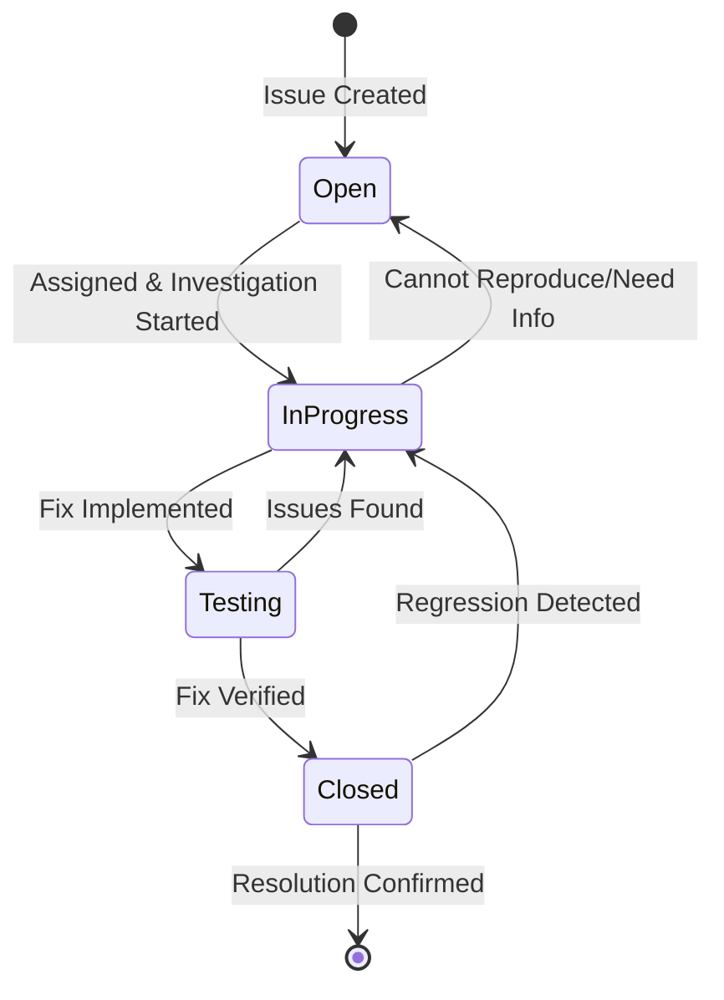

# Defect Resolution Process

## Overview
This document defines the systematic process for resolving defects in the MSP430 Emulator project, from initial investigation through final closure.

## Defect Lifecycle



## Lifecycle States

### Open
**Definition:** Defect has been reported and is awaiting assignment or investigation.

**Entry Criteria:**
- Issue created via bug report template
- Initial triage completed
- Severity level assigned

**Activities:**
- Gathering additional information
- Reproducing the issue
- Impact assessment
- Assignment to developer

**Exit Criteria:**
- Assigned to a developer
- Developer begins active investigation

**SLA Targets:**
- Critical: ≤ 4 hours
- High: ≤ 8 hours
- Medium: ≤ 24 hours
- Low: ≤ 1 week

### In Progress
**Definition:** Defect is actively being investigated or fixed by an assigned developer.

**Entry Criteria:**
- Developer has been assigned
- Issue is reproducible OR investigation strategy defined
- Work has begun

**Activities:**
- Root cause analysis
- Solution design
- Code implementation
- Unit test creation
- Code review
- Documentation updates

**Exit Criteria:**
- Fix implemented and code reviewed
- Tests created and passing
- Ready for verification testing

**Key Responsibilities:**
- **Developer:** Implement fix, create tests, update documentation
- **Reviewer:** Review code changes and test coverage
- **Tester:** Prepare test scenarios for verification

### Testing
**Definition:** Fix has been implemented and is undergoing verification testing.

**Entry Criteria:**
- Code changes merged to testing branch
- All automated tests passing
- Test scenarios prepared

**Activities:**
- Verification testing
- Regression testing
- Performance impact assessment
- Documentation review

**Exit Criteria:**
- Fix verified to resolve original issue
- No regressions detected
- Performance impact acceptable
- Documentation accurate

**Testing Types:**
- **Unit Tests:** Automated, must pass
- **Integration Tests:** Automated, must pass
- **Manual Verification:** Reproduce original scenario
- **Regression Tests:** Ensure no side effects

### Closed
**Definition:** Defect has been resolved and verified.

**Entry Criteria:**
- Fix verified to resolve issue
- All tests passing
- Stakeholders notified
- Documentation updated

**Activities:**
- Final verification
- Release preparation
- Metrics collection
- Lessons learned capture

**Exit Criteria:**
- Issue marked as resolved
- Customer notification sent (if applicable)
- Metrics updated

**Possible Transitions:**
- **Back to In Progress:** If regression detected
- **Final state:** Issue permanently resolved

## Resolution Strategies

### Root Cause Analysis

#### 5 Whys Technique
1. **Why did the issue occur?** - Immediate cause
2. **Why did that happen?** - Contributing factor
3. **Why was that the case?** - System cause
4. **Why wasn't this prevented?** - Process cause
5. **Why isn't this caught earlier?** - Root cause

#### Fishbone Diagram Categories
- **People:** Human factors, training, experience
- **Process:** Procedures, workflows, standards
- **Technology:** Tools, systems, infrastructure
- **Environment:** External factors, dependencies

### Fix Implementation Guidelines

#### Code Changes
- **Minimal Impact:** Make smallest possible change to fix issue
- **Defensive Programming:** Add appropriate error handling
- **Consistent Style:** Follow project coding standards
- **Performance Aware:** Consider performance implications

#### Testing Requirements
- **Fix Verification:** Test specifically addresses the reported issue
- **Regression Prevention:** Tests prevent issue recurrence
- **Edge Cases:** Cover boundary conditions and error paths
- **Integration:** Ensure fix works with other components

#### Documentation Updates
- **API Changes:** Update API documentation
- **Configuration:** Update configuration guides
- **Troubleshooting:** Add to troubleshooting guides
- **Release Notes:** Document fix for users

## Quality Gates

### Code Review Checklist
- [ ] Fix addresses root cause, not just symptoms
- [ ] Code follows project standards and patterns
- [ ] Appropriate error handling included
- [ ] Performance impact considered
- [ ] Security implications reviewed
- [ ] Tests cover fix and edge cases
- [ ] Documentation updated as needed

### Testing Checklist
- [ ] Original issue scenario passes
- [ ] All automated tests pass
- [ ] No regressions detected
- [ ] Performance impact acceptable
- [ ] Cross-platform compatibility verified
- [ ] Integration with other components works

### Release Readiness Checklist
- [ ] Code reviewed and approved
- [ ] All tests passing
- [ ] Documentation complete and accurate
- [ ] Performance impact documented
- [ ] Security review completed (if applicable)
- [ ] Deployment plan ready
- [ ] Rollback plan prepared

## Communication Protocol

### Status Updates

#### Critical Issues
- **Frequency:** Every 4 hours during business hours
- **Content:** Current status, blockers, next steps
- **Audience:** Stakeholders, management, affected teams

#### High Issues
- **Frequency:** Daily
- **Content:** Progress summary, estimated completion
- **Audience:** Project team, stakeholders

#### Medium/Low Issues
- **Frequency:** Weekly or at milestone boundaries
- **Content:** Progress summary, changes to timeline
- **Audience:** Project team

### Customer Communication
- **Initial Response:** Within SLA timeframe
- **Progress Updates:** Based on severity level
- **Resolution Notification:** When fix is ready for testing
- **Final Closure:** When issue is completely resolved

### Internal Communication
- **Team Updates:** In daily standups
- **Stakeholder Updates:** Via project management tools
- **Management Reports:** Weekly summary of critical/high issues

## Regression Prevention

### Test Automation
```csharp
[Fact]
public void DefectRegression_IssueXXX_ShouldNotRecur()
{
    // Arrange - Set up scenario that caused original defect
    var emulator = new MSP430Emulator();
    var testProgram = LoadTestProgram("regression_test_xxx.hex");
    
    // Act - Execute the problematic scenario
    emulator.LoadProgram(testProgram);
    var result = emulator.Execute();
    
    // Assert - Verify fix is working
    Assert.Equal(expectedResult, result);
    Assert.False(emulator.HasErrors);
}
```

### Regression Test Categories
- **Issue-Specific:** Tests for each resolved defect
- **Component-Level:** Comprehensive testing of affected components
- **Integration:** Cross-component interaction testing
- **Performance:** Ensure performance not degraded

### Continuous Monitoring
- **Automated Testing:** Run regression tests in CI/CD pipeline
- **Performance Monitoring:** Track performance metrics
- **Error Tracking:** Monitor for similar issues
- **User Feedback:** Collect feedback on resolution effectiveness

## Metrics and Reporting

### Resolution Metrics
- **Time to Resolution:** From assignment to closure
- **Fix Quality:** Number of regressions or reopened issues
- **Customer Satisfaction:** Feedback on resolution process
- **Code Quality:** Test coverage, code review feedback

### Process Metrics
- **SLA Compliance:** Percentage meeting response/resolution targets
- **Cycle Time:** Time spent in each lifecycle state
- **Rework Rate:** Issues requiring multiple fix attempts
- **Escape Rate:** Issues found after release

### Reporting Dashboards
- **Real-time Status:** Current issues by state and severity
- **Trend Analysis:** Resolution time trends by component
- **Quality Metrics:** Test coverage, regression rates
- **Team Performance:** Individual and team productivity

## Special Procedures

### Critical Issue Escalation
1. **Immediate Notification:** Alert all stakeholders
2. **War Room Setup:** Gather all necessary experts
3. **Continuous Updates:** Hourly status reports
4. **Decision Authority:** Clearly defined escalation path
5. **Post-Mortem:** Required for all critical issues

### Security Issue Handling
1. **Confidential Tracking:** Use private issue tracker
2. **Limited Access:** Restrict to security team
3. **Coordinated Disclosure:** Follow security policy
4. **Comprehensive Testing:** Security-focused testing
5. **Audit Trail:** Complete record of all actions

### Customer-Reported Issues
1. **Customer Communication:** Regular updates via support team
2. **Priority Handling:** Higher priority than internal issues
3. **Verification:** Customer testing before closure
4. **Satisfaction Survey:** Post-resolution feedback collection

## Integration with DefectTracker

### Status Transitions
```csharp
// Example of moving defect through lifecycle
var defect = defectTracker.GetDefect(defectId);

// Start work on defect
defect.Status = DefectStatus.InProgress;
defect.Assignee = assignedDeveloper;
defectTracker.UpdateDefect(defectId, defect);

// Move to testing
defect.Status = DefectStatus.Testing;
defectTracker.UpdateDefect(defectId, defect);

// Close defect
defect.Status = DefectStatus.Closed;
defectTracker.UpdateDefect(defectId, defect);
```

### Metrics Collection
```csharp
// Generate resolution metrics
var metrics = defectTracker.GetDefectMetrics();
var resolutionTime = CalculateAverageResolutionTime(metrics);
var regressionRate = CalculateRegressionRate(metrics);
```

## Continuous Improvement

### Process Reviews
- **Monthly:** Review resolution times and quality metrics
- **Quarterly:** Assess process effectiveness and identify improvements
- **Annually:** Comprehensive review of entire resolution process

### Best Practices Updates
- Capture lessons learned from critical issues
- Update process based on team feedback
- Incorporate industry best practices
- Refine automation and tooling

### Training and Development
- Regular training on resolution process
- Knowledge sharing sessions
- Cross-training on different components
- Process improvement workshops