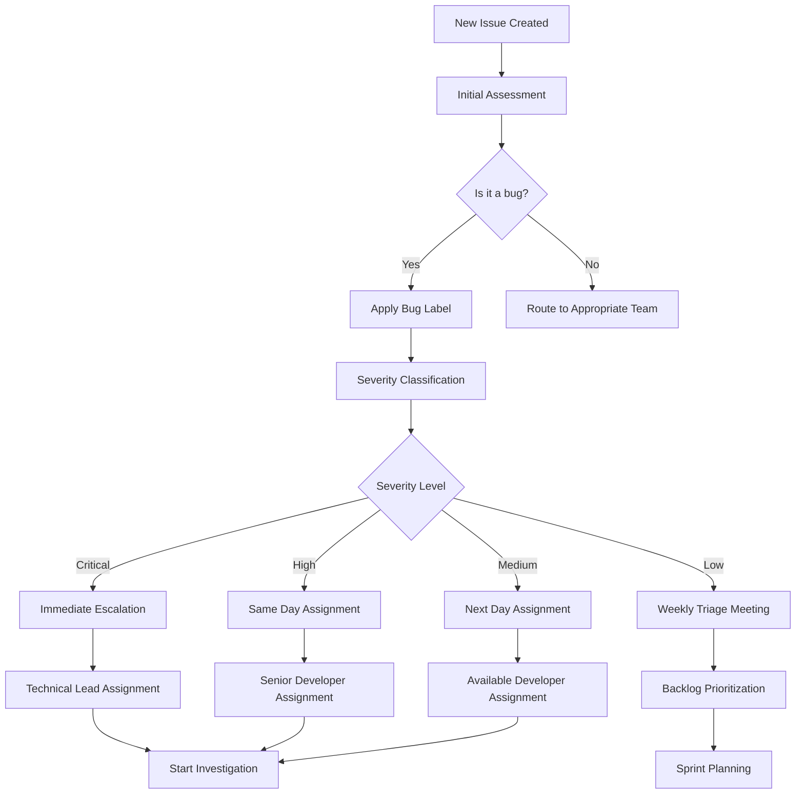

# Defect Triage Workflow

## Overview
This document outlines the systematic process for triaging, assigning, and prioritizing defects in the MSP430 Emulator project.

## Triage Process Flow



## Triage Roles and Responsibilities

### Triage Lead
**Primary Responsibilities:**
- Oversee daily triage process
- Make final decisions on severity classification
- Escalate critical issues to stakeholders
- Ensure SLA compliance

**Qualifications:**
- Senior technical team member
- Deep understanding of system architecture
- Authority to make assignment decisions

### Triage Team Members
**Primary Responsibilities:**
- Perform initial issue assessment
- Gather additional information when needed
- Assign severity levels
- Route issues to appropriate teams

**Qualifications:**
- Technical understanding of the system
- Experience with issue tracking systems
- Good communication skills

### Component Owners
**Primary Responsibilities:**
- Provide technical expertise for their components
- Accept or reject issue assignments
- Provide effort estimates
- Escalate blocking issues

## Triage Schedule

### Daily Triage (Critical/High Issues)
**Time:** 9:00 AM local time
**Duration:** 30 minutes maximum
**Attendees:** Triage lead, available team members
**Scope:** All new Critical/High severity issues

### Weekly Triage (All Issues)
**Time:** Mondays, 10:00 AM local time
**Duration:** 60 minutes maximum
**Attendees:** Full triage team, component owners
**Scope:** All new and unassigned issues

### Emergency Triage
**Trigger:** Critical security issues or system-down scenarios
**Response Time:** Within 1 hour
**Process:** Direct escalation to on-call engineer

## Assignment Rules

### Automatic Assignment Rules

#### By Severity
- **Critical:** Always assigned to Senior Developer or Technical Lead
- **High:** Assigned to Senior Developer
- **Medium:** Assigned to available experienced developer
- **Low:** Added to backlog for sprint planning

#### By Component
- **CPU Core issues:** Assigned to CPU team lead
- **Memory System issues:** Assigned to Memory team lead
- **Peripheral issues:** Assigned to Peripheral team lead
- **Configuration issues:** Assigned to Infrastructure team
- **Documentation issues:** Assigned to Documentation team

#### By Complexity
- **New features:** Require architecture review before assignment
- **Bug fixes:** Direct assignment based on component
- **Performance issues:** Assigned to Performance team
- **Security issues:** Assigned to Security team lead

### Load Balancing
- Consider current workload of team members
- Rotate assignments among qualified developers
- Avoid overloading any single contributor
- Respect individual strengths and expertise areas

## Prioritization Framework

### Priority Matrix
| Severity | Customer Impact | Business Impact | Priority |
|----------|----------------|-----------------|----------|
| Critical | High | High | P0 |
| Critical | High | Medium | P0 |
| Critical | Medium | High | P0 |
| High | High | High | P1 |
| High | High | Medium | P1 |
| High | Medium | Medium | P2 |
| Medium | High | Medium | P2 |
| Medium | Medium | Medium | P2 |
| Low | Any | Any | P3 |

### Special Considerations

#### Customer-Reported Issues
- Add +1 priority level (unless already P0)
- Require customer communication plan
- Track resolution status more closely

#### Regression Issues
- Always treated as one level higher than base severity
- Blocking for next release
- Require immediate investigation

#### Dependencies
- Issues blocking other work get priority boost
- Consider dependency chains in assignment
- Communicate blocking relationships clearly

## Information Gathering

### Required Information for Triage

#### All Issues
- Clear problem description
- Steps to reproduce
- Expected vs. actual behavior
- Environment details (.NET version, OS, etc.)

#### Critical/High Issues
- Impact assessment
- Workaround availability
- Customer communication needs
- Escalation contacts

#### Performance Issues
- Baseline performance metrics
- Current performance measurements
- Hardware specifications
- Test methodology

### Information Gathering Process
1. **Initial Reporter:** Provides basic information
2. **Triage Team:** Requests additional details if needed
3. **Component Owner:** May request technical deep-dive
4. **Assignment:** Only after sufficient information gathered

## Decision Making Process

### Consensus Building
- Aim for consensus on severity classification
- Document dissenting opinions
- Escalate to Triage Lead if no consensus reached

### Override Authority
- Triage Lead can override team decisions
- Product Owner can escalate business priority
- Technical Lead can escalate technical priority

### Appeal Process
- Any team member can appeal triage decisions
- Appeals reviewed in next triage meeting
- Final appeal to Engineering Manager

## Communication Protocol

### Status Updates
- **Critical:** Hourly updates during active work
- **High:** Daily status updates
- **Medium:** Updates at milestone boundaries
- **Low:** Updates in sprint reviews

### Stakeholder Notification
- **Critical issues:** Immediate notification to all stakeholders
- **Customer issues:** Regular updates to customer success team
- **Security issues:** Follow security communication protocol

### Documentation Requirements
- All triage decisions must be documented in issue tracker
- Include rationale for severity classification
- Record assignment reasoning
- Track any changes to initial assessment

## Metrics and Continuous Improvement

### Triage Metrics
- Time from issue creation to initial triage
- Time from triage to assignment
- Accuracy of initial severity classification
- Workload distribution across team members

### Quality Metrics
- Issues requiring re-triage
- Escaped defects (found in production)
- Customer satisfaction with issue resolution

### Process Improvement
- Monthly triage process retrospectives
- Quarterly review of assignment rules
- Annual review of severity classification criteria

## Tools and Integration

### GitHub Integration
- Automated label application based on triage decisions
- Assignment notifications
- SLA tracking and alerting
- Metrics dashboard

### DefectTracker Integration
```csharp
// Example of updating defect status during triage
var defect = defectTracker.GetDefect(issueId);
defect.Severity = DefectSeverity.High;
defect.Assignee = "senior.developer@company.com";
defect.Status = DefectStatus.InProgress;
defectTracker.UpdateDefect(issueId, defect);
```

### Notification System
- Slack/Teams integration for real-time updates
- Email notifications for critical issues
- Dashboard displays for team awareness