# MSP430 Memory Access Flow

This document provides comprehensive visual documentation of the memory access validation flow in
the MSP430 emulator, showing how memory operations are validated against the memory map and access permissions.

## Memory Access Validation Flowchart


## Access Type Validation Matrix

| Access Type | Binary Flag | Description | Used For |
|-------------|-------------|-------------|----------|
| **None** | `0b000` (0x00) | No access permitted | Unmapped regions |
| **Read** | `0b001` (0x01) | Read operations allowed | Data loading, register reads |
| **Write** | `0b010` (0x02) | Write operations allowed | Data storing, register writes |
| **Execute** | `0b100` (0x04) | Instruction fetch allowed | Program execution |
| **ReadWrite** | `0b011` (0x03) | Read + Write combined | Data memory regions |
| **ReadExecute** | `0b101` (0x05) | Read + Execute combined | Code memory regions |
| **All** | `0b111` (0x07) | Full access permissions | General-purpose memory |

## Memory Access Decision Tree


## Memory Region Access Permissions

```mermaid
block-beta
    columns 4
    
    block:legend["Permission Types"]:4
        read["🔍 Read\nData loading\nRegister reads"]
        write["✏️ Write\nData storing\nRegister writes"]
        exec["⚡ Execute\nInstruction fetch\nProgram execution"]
        none["🚫 No Access\nUnmapped regions\nRestricted areas"]
    end
    
    block:regions["Memory Regions"]:4
        sfr["Special Function Registers\n0x0000-0x00FF\n🔍 Read + ✏️ Write"]
        per8["8-bit Peripherals\n0x0100-0x01FF\n🔍 Read + ✏️ Write"]
        per16["16-bit Peripherals\n0x0200-0x027F\n🔍 Read + ✏️ Write"]
        gap1["Unmapped Space\n0x0280-0x0FFF\n🚫 No Access"]
        
        bsl["Bootstrap Loader\n0x1000-0x17FF\n🔍 Read + ⚡ Execute"]
        info["Information Memory\n0x1800-0x19FF\n🔍 Read + ✏️ Write"]
        gap2["Unmapped Space\n0x1A00-0x1FFF\n🚫 No Access"]
        gap3["Unmapped Space\n0x3000-0x3FFF\n🚫 No Access"]
        
        ram["SRAM\n0x2000-0x2FFF\n🔍 Read + ✏️ Write + ⚡ Execute"]
        fram["FRAM Memory\n0x4000-0xBFFF\n🔍 Read + ✏️ Write + ⚡ Execute"]
        gap4["Unmapped Space\n0xC000-0xFFDF\n🚫 No Access"]
        ivt["Interrupt Vectors\n0xFFE0-0xFFFF\n🔍 Read + ⚡ Execute"]
    end

    style read fill:#e1f5fe
    style write fill:#e8f5e8
    style exec fill:#fff3e0
    style none fill:#ffebee
    style sfr fill:#e1f5fe
    style per8 fill:#e8f5e8
    style per16 fill:#e8f5e8
    style bsl fill:#fff3e0
    style info fill:#fffde7
    style ram fill:#f3e5f5
    style fram fill:#f3e5f5
    style ivt fill:#fff3e0
    style gap1 fill:#f5f5f5
    style gap2 fill:#f5f5f5
    style gap3 fill:#f5f5f5
    style gap4 fill:#f5f5f5
```



## Validation Sequence Diagram


## Error Handling and Logging

### Exception Types

```text
MemoryAccessException
├── Invalid Address Exceptions
│   ├── Address not mapped to any region
│   ├── Address outside 16-bit range
│   └── Null/undefined address handling
└── Access Permission Exceptions
    ├── Read access denied
    ├── Write access denied
    ├── Execute access denied
    └── Combined access denied
```

### Logging Levels

| Level | Usage | Information Logged |
|-------|-------|-------------------|
| **Debug** | Successful access validation | Address, region, access type, validation success |
| **Warning** | Access violations | Address, requested access, allowed permissions, region info |
| **Error** | System-level memory errors | Critical memory system failures |

### Context Information in Logs

```json
{
  "Address": "0x2000",
  "Region": "Ram", 
  "RequestedAccess": "Write",
  "AllowedPermissions": "ReadWriteExecute",
  "ValidationResult": "Success"
}
```

## Performance Characteristics

### Address Lookup Performance

- **Time Complexity**: O(1) - Constant time lookup using pre-built address table
- **Space Complexity**: O(n) - Linear space proportional to address space (64KB)
- **Memory Usage**: 65,536 × sizeof(MemoryRegionInfo) bytes for lookup table

### Validation Steps

1. **Address Bounds Check**: Verify address is within 16-bit range
2. **Region Lookup**: O(1) array access to get region info
3. **Permission Check**: Bitwise AND operation on permission flags
4. **Logging**: Conditional logging based on result and log level

---

## References

This documentation is based on official Texas Instruments documentation:

**Primary References:**

- **MSP430FR2xx FR4xx Family User's Guide** (SLAU445I) - October 2014–Revised March 2019
  - Section 2.2.1: "Memory Protection and Access Permissions" - Access control mechanisms
  - Section 6.3: "FRAM Access and Write Protection" - Memory access validation procedures
  - Section 1.4.1: "Memory Protection Unit (MPU)" - Hardware-level access control
- **MSP430FR2355 Mixed-Signal Microcontroller Datasheet** (SLAS847G, October 2016 - Revised December 2019)
  - Section 6: "Memory Organization" - Access permission specifications

**Access Permission Implementation:**

- Based on SLAU445I Section 6.3: "FRAM Write Protection" for write access control
- Read/Execute permissions derived from SLAU445I Section 1.9.1: "Memory Map"
- Exception handling follows TI recommended error reporting patterns

*This documentation corresponds to the MSP430.Emulator.Memory.MemoryAccessValidator implementation*
