# MSP430FR2355 Memory Layout

This document provides comprehensive visual documentation of the MSP430FR2355 memory address space architecture, showing the 16-bit unified memory model with detailed address ranges and access permissions.

## Memory Address Space Overview

The MSP430FR2355 uses a unified 16-bit address space (0x0000-0xFFFF) with FRAM-based architecture for modern non-volatile memory capabilities.

```mermaid
block-beta
    columns 3
    block:memory["MSP430FR2355 Memory Map"]:3
        sfr["Special Function Registers\n0x0000-0x00FF\n256 bytes\nRead/Write"]
        per8["8-bit Peripherals\n0x0100-0x01FF\n256 bytes\nRead/Write"]
        per16["16-bit Peripherals\n0x0200-0x027F\n128 bytes\nRead/Write"]
        
        gap1["Unmapped\n0x0280-0x0FFF\n3456 bytes\nNo Access"]
        
        bsl["Bootstrap Loader FRAM\n0x1000-0x17FF\n2048 bytes\nRead/Execute"]
        info["Information Memory FRAM\n0x1800-0x19FF\n512 bytes\nRead/Write"]
        
        gap2["Unmapped\n0x1A00-0x1FFF\n1536 bytes\nNo Access"]
        
        ram["SRAM\n0x2000-0x2FFF\n4096 bytes\nRead/Write/Execute"]
        
        gap3["Unmapped\n0x3000-0x3FFF\n4096 bytes\nNo Access"]
        
        fram["FRAM Memory\n0x4000-0xBFFF\n32768 bytes\nRead/Write/Execute"]
        
        gap4["Unmapped\n0xC000-0xFFDF\n16352 bytes\nNo Access"]
        
        ivt["Interrupt Vector Table\n0xFFE0-0xFFFF\n32 bytes\nRead/Execute"]
    end

    style sfr fill:#e1f5fe
    style per8 fill:#e8f5e8
    style per16 fill:#e8f5e8
    style bsl fill:#fff3e0
    style info fill:#fffde7
    style ram fill:#fce4ec
    style fram fill:#f3e5f5
    style ivt fill:#ffebee
    style gap1 fill:#f5f5f5
    style gap2 fill:#f5f5f5
    style gap3 fill:#f5f5f5
    style gap4 fill:#f5f5f5
```



## Detailed Memory Region Table

| Region | Start Address | End Address | Size (bytes) | Permissions | Description |
|--------|---------------|-------------|--------------|-------------|-------------|
| **Special Function Registers** | 0x0000 | 0x00FF | 256 | Read/Write | System control and status registers |
| **8-bit Peripherals** | 0x0100 | 0x01FF | 256 | Read/Write | Memory-mapped 8-bit peripheral registers |
| **16-bit Peripherals** | 0x0200 | 0x027F | 128 | Read/Write | Memory-mapped 16-bit peripheral registers |
| *Unmapped* | 0x0280 | 0x0FFF | 3,456 | None | Unused address space |
| **Bootstrap Loader FRAM** | 0x1000 | 0x17FF | 2,048 | Read/Execute | Bootstrap loader code in FRAM memory |
| **Information Memory FRAM** | 0x1800 | 0x19FF | 512 | Read/Write | Calibration data and device-specific info |
| *Unmapped* | 0x1A00 | 0x1FFF | 1,536 | None | Unused address space |
| **SRAM** | 0x2000 | 0x2FFF | 4,096 | Read/Write/Execute | High-speed volatile memory |
| *Unmapped* | 0x3000 | 0x3FFF | 4,096 | None | Unused address space |
| **FRAM Memory** | 0x4000 | 0xBFFF | 32,768 | Read/Write/Execute | Non-volatile unified code/data storage |
| *Unmapped* | 0xC000 | 0xFFDF | 16,352 | None | Unused address space |
| **Interrupt Vector Table** | 0xFFE0 | 0xFFFF | 32 | Read/Execute | Interrupt service routine addresses |

## Memory Access Permissions Matrix

```mermaid
gitgraph
    commit id: "0x0000: SFR Start (RW)"
    commit id: "0x00FF: SFR End"
    commit id: "0x0100: 8-bit Peripherals (RW)"
    commit id: "0x01FF: 8-bit End"
    commit id: "0x0200: 16-bit Peripherals (RW)"
    commit id: "0x027F: 16-bit End"
    commit id: "0x1000: Bootstrap Loader (RX)"
    commit id: "0x17FF: BSL End"
    commit id: "0x1800: Info Memory (RW)"
    commit id: "0x19FF: Info End"
    commit id: "0x2000: SRAM Start (RWX)"
    commit id: "0x2FFF: SRAM End"
    commit id: "0x4000: FRAM Start (RWX)"
    commit id: "0xBFFF: FRAM End"
    commit id: "0xFFE0: IVT Start (RX)"
    commit id: "0xFFFF: IVT End"
```

### Permission Legend
- **R** = Read Access Allowed
- **W** = Write Access Allowed  
- **X** = Execute Access Allowed
- **RW** = Read + Write
- **RX** = Read + Execute
- **RWX** = Read + Write + Execute

## Memory Architecture Characteristics

### FRAM Technology Benefits
```
┌─────────────────────────────────────────────────────────────┐
│ FRAM (Ferroelectric RAM) vs Traditional Flash Memory        │
├─────────────────────────────────────────────────────────────┤
│ ✓ Byte-level write operations (no erase cycles required)   │
│ ✓ Fast write speeds (comparable to SRAM)                   │
│ ✓ Low power consumption                                     │
│ ✓ High endurance (10^15 write cycles)                      │
│ ✓ Unified code/data memory model                           │
│ ✓ Instant-on capability (no boot delay)                    │
└─────────────────────────────────────────────────────────────┘
```

### Memory Segmentation Summary

```
Total Address Space: 64KB (65,536 bytes)
├── Mapped Regions: 39,936 bytes (61.0%)
│   ├── System/Peripherals: 640 bytes (1.0%)
│   ├── Bootstrap/Info: 2,560 bytes (3.9%)
│   ├── Volatile Memory (SRAM): 4,096 bytes (6.3%)
│   ├── Non-volatile Memory (FRAM): 32,768 bytes (50.0%)
│   └── Interrupt Vectors: 32 bytes (0.05%)
└── Unmapped Regions: 25,600 bytes (39.0%)
```

## Address Validation Rules

1. **Valid Address Range**: 0x0000 to 0xFFFF (16-bit addressing)
2. **Mapped Addresses**: Must fall within defined memory regions
3. **Access Control**: Enforced based on region-specific permissions
4. **Alignment**: Some operations may require word alignment (even addresses)

## Implementation Notes

- Fast O(1) address lookup using pre-built address lookup table
- Memory regions are validated for overlaps during initialization
- Access validation includes both address validity and permission checks
- Debug logging available for memory access operations
- Exception handling for invalid access attempts

---

*This documentation corresponds to the MSP430.Emulator.Memory implementation*  
*Reference: MSP430FR2355 Mixed-Signal Microcontroller Family User's Guide*