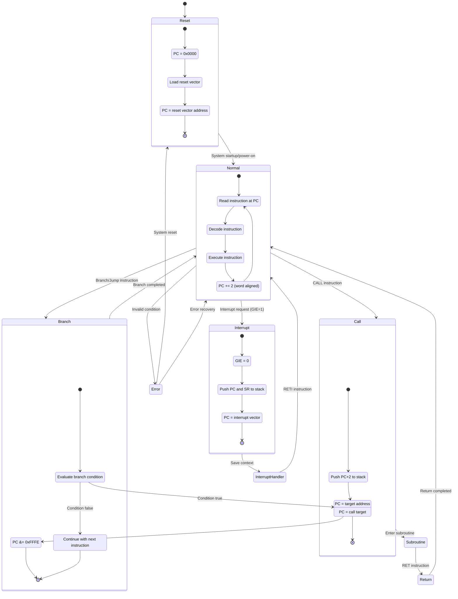
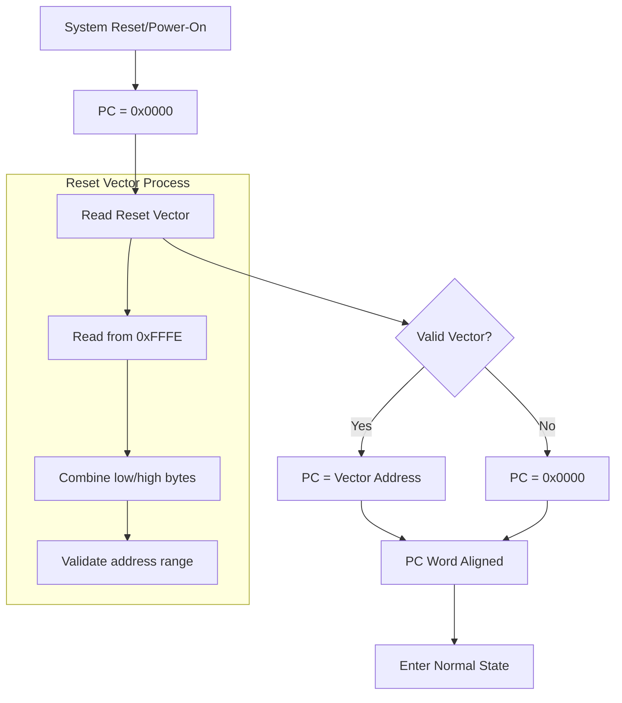
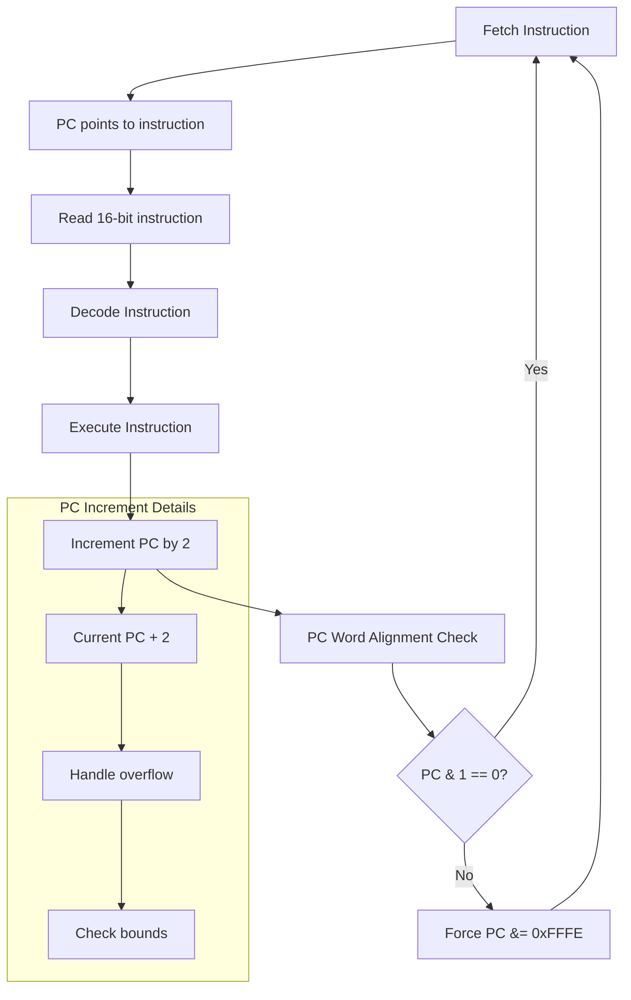
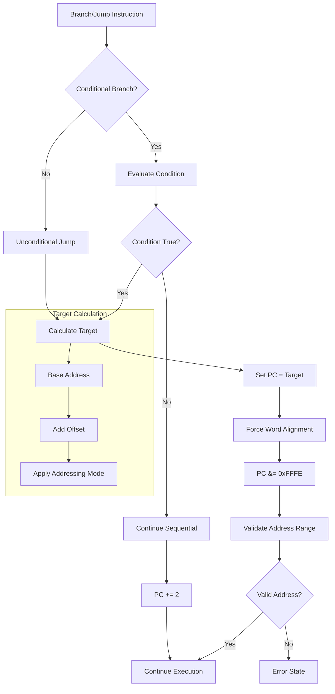
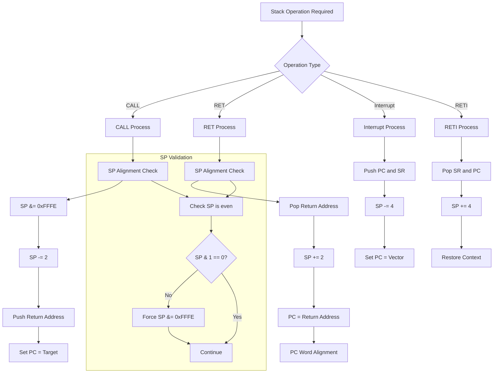
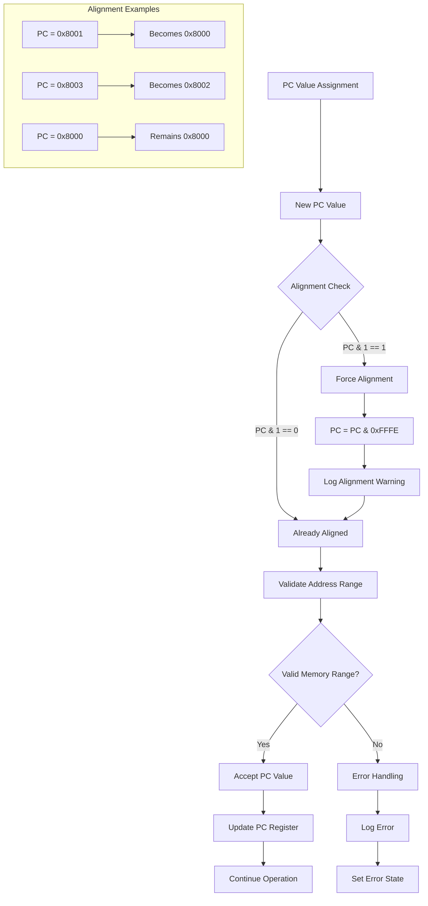
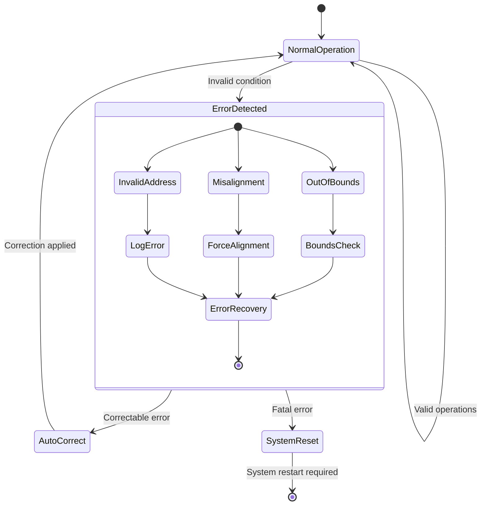
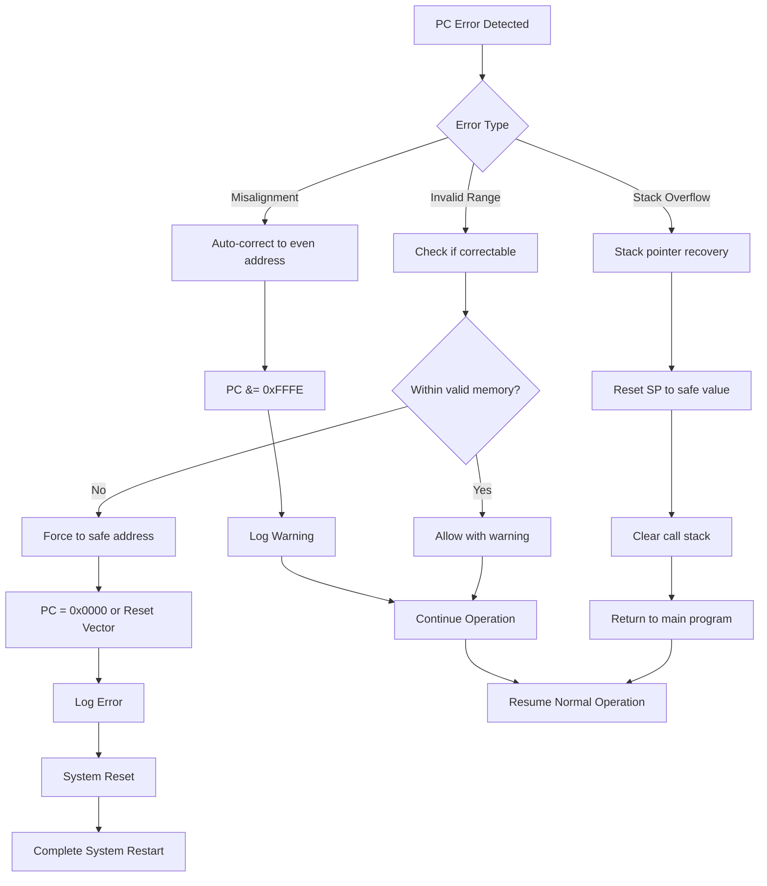

# MSP430 Program Counter State Transitions

## Program Counter (PC/R0) State Management

The Program Counter (PC) operates in distinct states with specific transition conditions. This document provides comprehensive state diagrams and flowcharts for PC behavior.

## PC State Overview

### Primary PC States



## Detailed State Behaviors

### Reset State Operations



### Normal Execution Cycle



### Branch/Jump Operations



### Subroutine Call/Return Flow

```mermaid
flowchart TD
    A[CALL Instruction] --> B[Calculate Return Address]
    B --> C[Return = PC + 2]
    C --> D[Push Return to Stack]
    D --> E[SP -= 2]
    E --> F[Memory[SP] = Return]
    F --> G[Set PC = Call Target]
    G --> H[Word Align PC]
    H --> I[Enter Subroutine]
    
    I --> J[Execute Subroutine]
    J --> K[RET Instruction]
    K --> L[Pop Return Address]
    L --> M[Return = Memory[SP]]
    M --> N[SP += 2]
    N --> O[PC = Return Address]
    O --> P[Word Align PC]
    P --> Q[Continue Main Program]
    
    subgraph "Stack Operations"
        D --> D1[Check Stack Bounds]
        D1 --> D2[Verify SP Alignment]
        L --> L1[Check Stack Bounds]
        L1 --> L2[Verify SP Alignment]
    end
```

### Interrupt Processing

```mermaid
flowchart TD
    A[Interrupt Request] --> B{GIE Flag Set?}
    B -->|No| C[Ignore Interrupt]
    B -->|Yes| D[Complete Current Instruction]
    
    D --> E[Save Current PC]
    E --> F[Push PC to Stack]
    F --> G[Push SR to Stack]
    G --> H[Clear GIE Flag]
    H --> I[Read Interrupt Vector]
    I --> J[PC = Vector Address]
    J --> K[Word Align PC]
    K --> L[Execute ISR]
    
    L --> M[RETI Instruction]
    M --> N[Pop SR from Stack]
    N --> O[Pop PC from Stack]
    O --> P[Restore GIE Flag]
    P --> Q[Continue Normal Execution]
    
    C --> R[Continue Normal Execution]
    
    subgraph "Context Save/Restore"
        F --> F1[SP -= 2, Memory[SP] = PC]
        G --> G1[SP -= 2, Memory[SP] = SR]
        N --> N1[SR = Memory[SP], SP += 2]
        O --> O1[PC = Memory[SP], SP += 2]
    end
```

## Stack Pointer Interaction

### Stack Operations During PC Changes



## PC Word Alignment Enforcement

### Alignment Rules and Enforcement



## Error Conditions and Recovery

### PC Error State Management



### Error Recovery Flowchart



## Implementation Notes

### Register File Integration

1. **PC Storage**: Stored in register array index 0 (`_registers[0]`)
2. **Word Alignment**: Enforced on all PC writes (`value & 0xFFFE`)
3. **Range Validation**: Checked against valid memory regions
4. **Logging**: Debug-level logging for all PC changes

### Special Behaviors

1. **Automatic Increment**: PC increments by 2 during instruction fetch
2. **Alignment Enforcement**: Odd addresses automatically rounded down
3. **Stack Integration**: PC saved/restored during calls and interrupts
4. **Error Handling**: Invalid addresses logged and corrected where possible

### Usage Examples

```csharp
// Direct PC manipulation
registerFile.SetProgramCounter(0x8000);
ushort pc = registerFile.GetProgramCounter();

// Instruction fetch simulation
registerFile.IncrementProgramCounter(); // PC += 2

// Automatic alignment
registerFile.SetProgramCounter(0x8001); // Becomes 0x8000

// Call/return simulation
ushort returnAddress = registerFile.GetProgramCounter() + 2;
// Push returnAddress to stack via SP operations
registerFile.SetProgramCounter(callTarget);
```