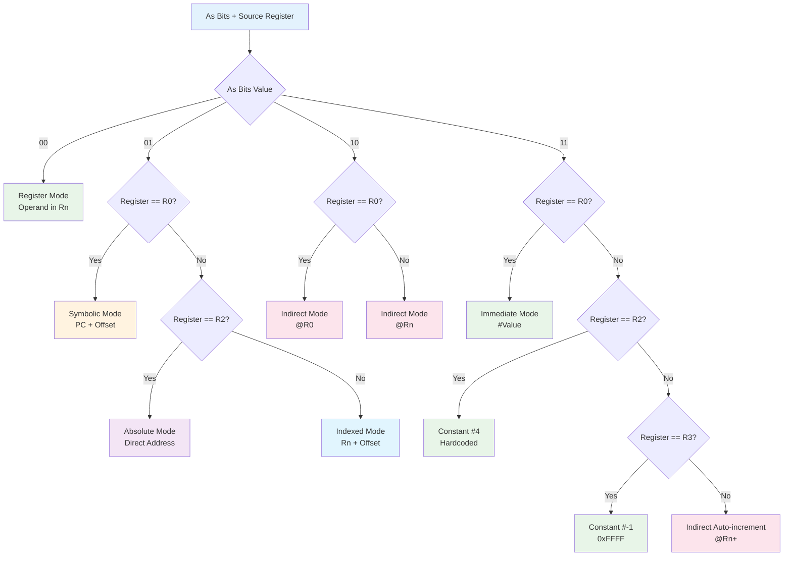
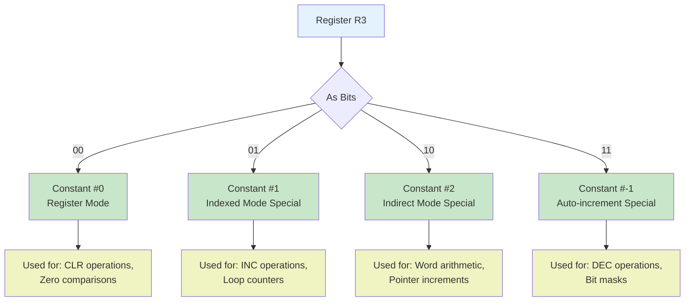
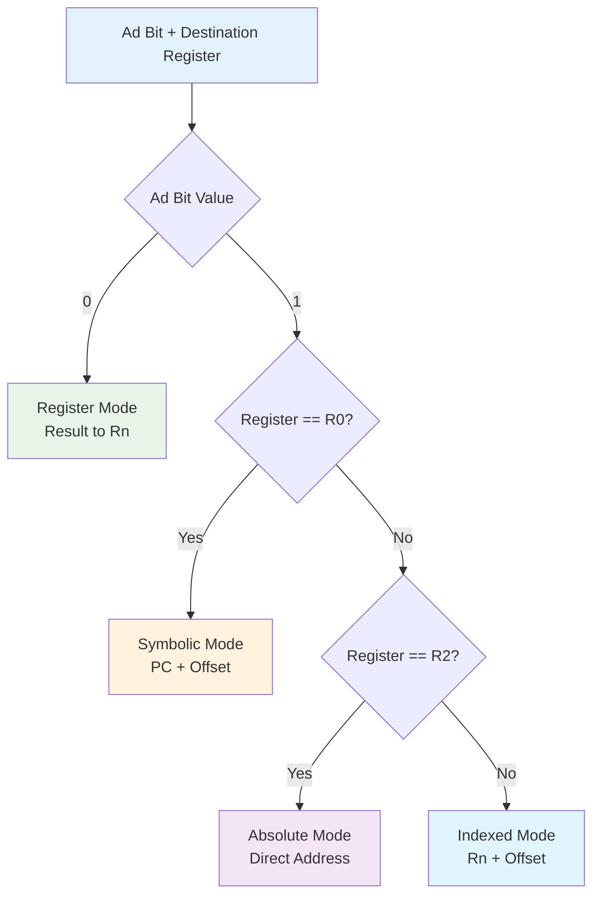
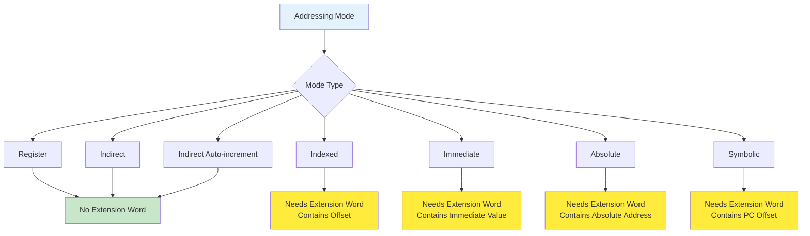
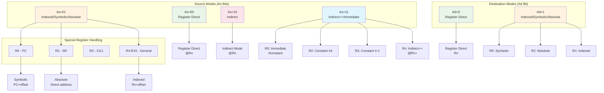
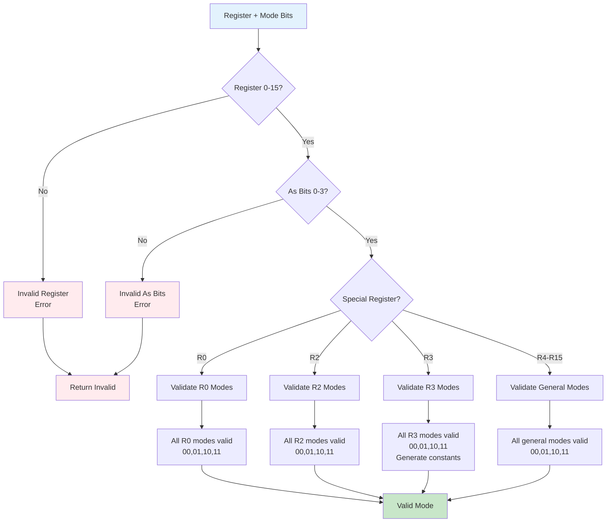

# MSP430 Addressing Mode Decision Trees

This document provides decision flowcharts for decoding MSP430 addressing modes based on register numbers and As/Ad bits.

## Source Addressing Mode Decoding

## R3 Constant Generator Special Cases

## Destination Addressing Mode Decoding

## Extension Word Requirements

## Complete Addressing Mode Matrix

## Addressing Mode Validation

## Implementation Notes

### Register-Specific Behaviors

**R0 (Program Counter):**
- As=00: Register mode (current PC value)
- As=01: Symbolic mode (PC + extension word)
- As=10: Indirect mode (@PC - unusual but valid)
- As=11: Immediate mode (#constant from extension word)

**R2 (Status Register):**
- As=00: Register mode (current SR value)
- As=01: Absolute mode (&address from extension word)
- As=10: Indirect mode (@SR - unusual but valid)
- As=11: Constant #4 (no extension word needed)

**R3 (Constant Generator):**
- As=00: Constant #0
- As=01: Constant #1
- As=10: Constant #2
- As=11: Constant #-1 (0xFFFF)

**R4-R15 (General Purpose):**
- As=00: Register mode (register content)
- As=01: Indexed mode (register + extension word offset)
- As=10: Indirect mode (@register)
- As=11: Indirect auto-increment (@register, then register++)

### Extension Word Usage

When an addressing mode requires an extension word:
1. **Source operand extension word** comes immediately after instruction
2. **Destination operand extension word** comes after source extension word
3. Extension words are 16-bit values
4. Multiple extension words are read in program order

### Performance Optimization

The addressing mode decoder is optimized using:
1. **Switch expressions** for fast register-specific dispatching
2. **Bit masking** for efficient field extraction
3. **Early validation** to catch errors quickly
4. **Lookup tables** for constant generator values