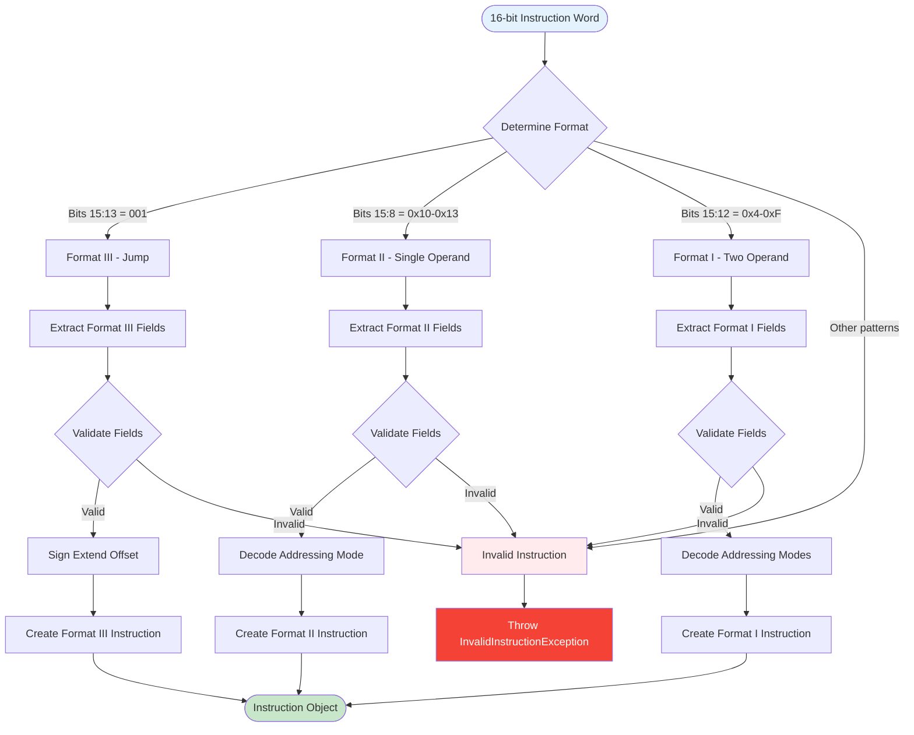
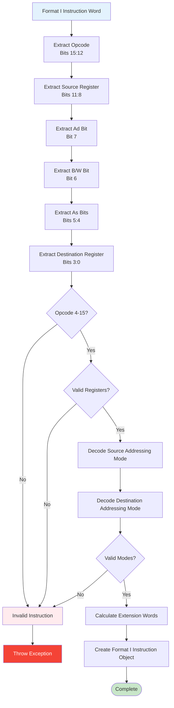
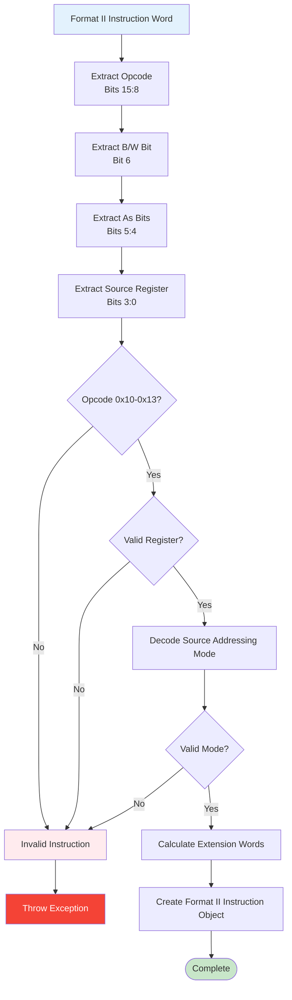
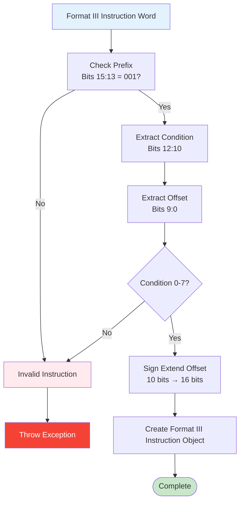
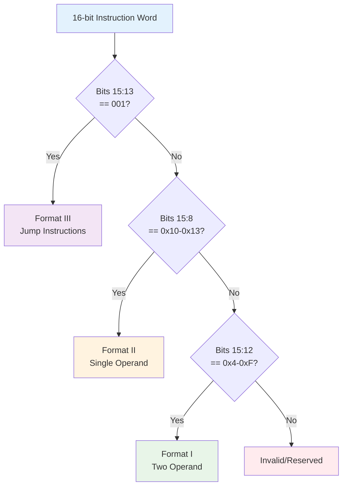
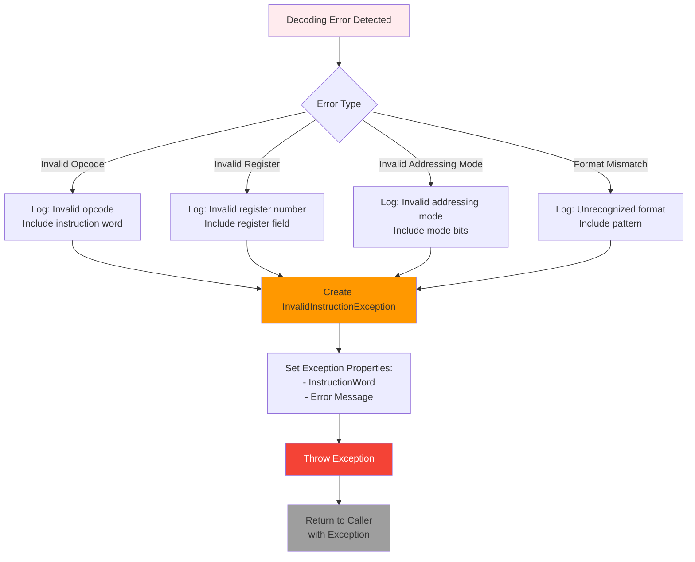
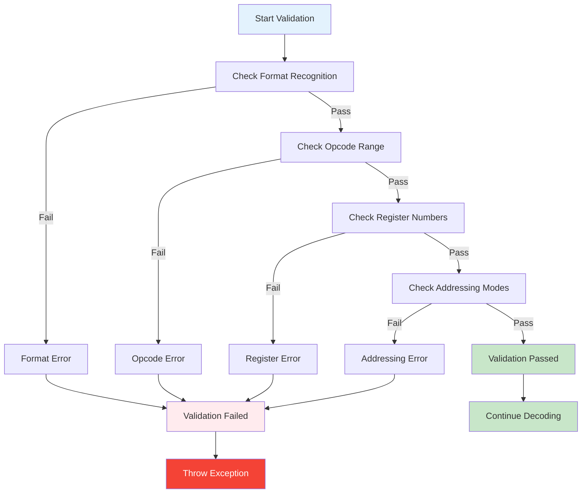

# MSP430 Instruction Decoding Flow

This document provides flowcharts showing the decision-making process for decoding MSP430 instructions.

## Main Instruction Decoding Flow

## Format I Decoding Detail

## Format II Decoding Detail

## Format III Decoding Detail

## Format Detection Logic

## Error Handling Flow

## Validation Process

## Performance Considerations

The decoding process is optimized for performance:

1. **Early Exit**: Invalid instructions are detected as early as possible
2. **Bit Masking**: Efficient bit operations for field extraction
3. **Lookup Tables**: Fast opcode and addressing mode validation
4. **Minimal Allocations**: Reuse of temporary variables where possible

## Debugging Support

The decoder provides comprehensive error information:

- **Original instruction word** preserved in all instruction objects
- **Detailed error messages** with specific failure reasons
- **Bit-level field values** for debugging instruction encoding
- **Exception context** includes the problematic instruction word