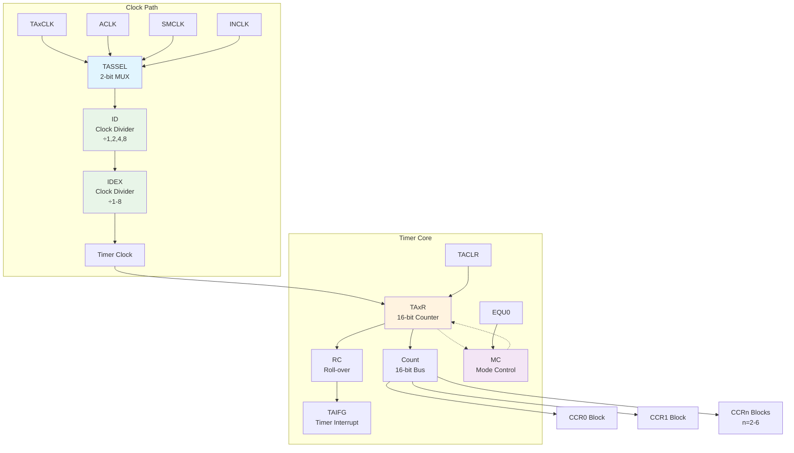
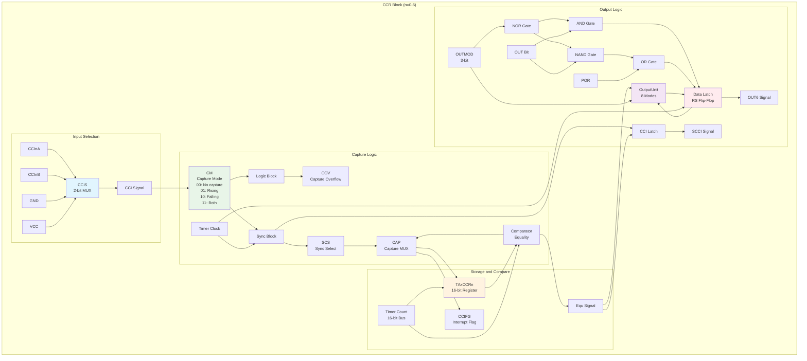
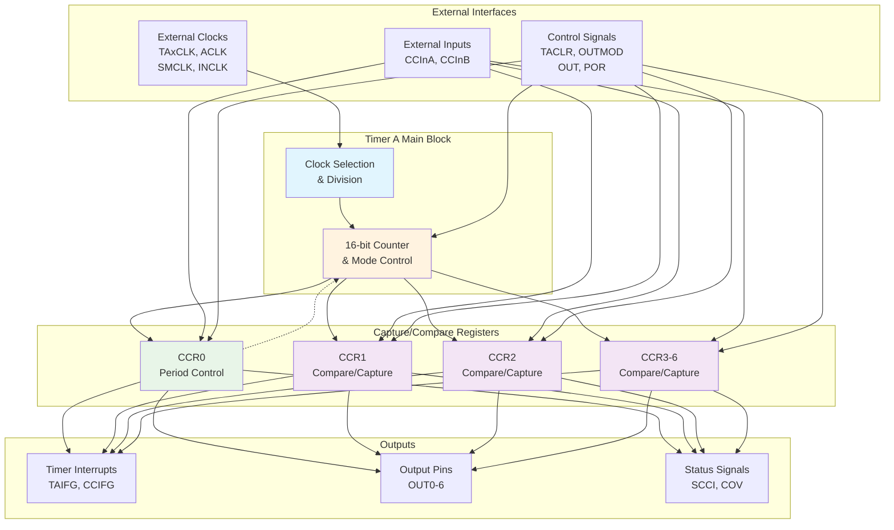
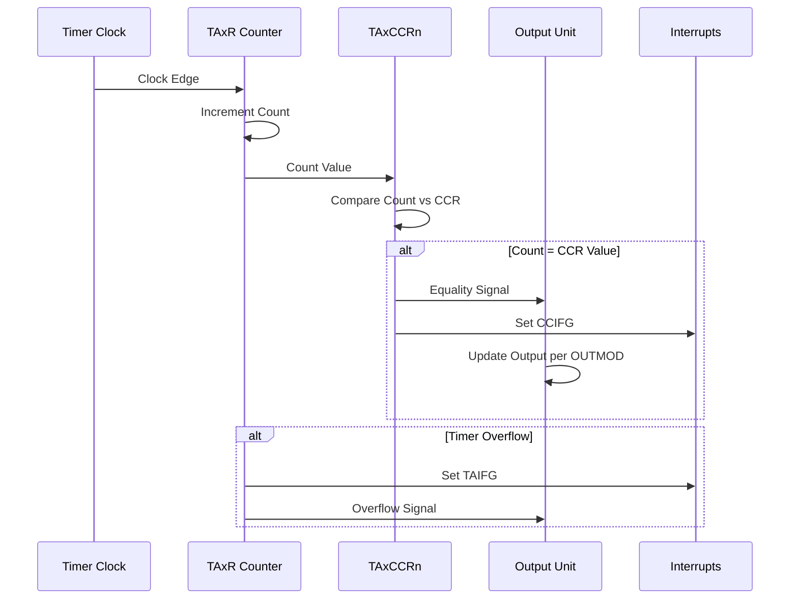
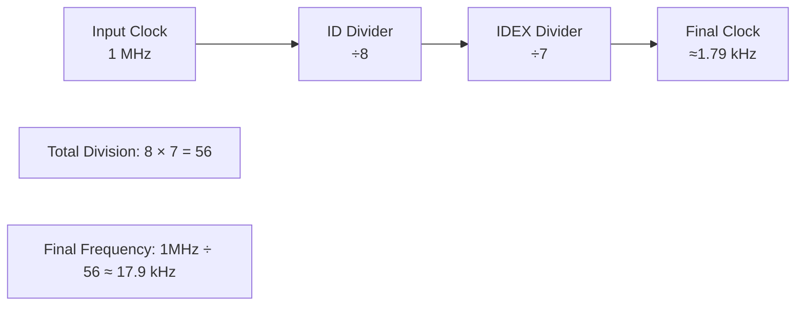

# Timer A Figure 13-1 Visual Representation

This document provides visual representations of Timer A Figure 13-1. The documentation includes
both Mermaid diagrams for quick reference and detailed SVG diagrams that meet professional circuit
documentation standards.

## Professional SVG Diagrams

The following native SVG diagrams provide detailed technical illustrations:

- **[Timer A Main Block](timer_a_main_block.svg)** - Clock path and timer core with proper
  electrical symbols
- **[CCR Block Detail](timer_a_ccr_block.svg)** - Complete capture/compare register architecture
- **[Complete Timer A System](timer_a_complete_system.svg)** - System overview with all
  interconnections

These SVG diagrams feature:

- ✅ Appropriate symbols for each logic block
- ✅ No overlapping blocks  
- ✅ No crossing connections
- ✅ Branched style connections with multiple endpoints
- ✅ Connection dots showing connected vs crossing lines
- ✅ Orthogonal line routing
- ✅ Professional circuit diagram standards

## Mermaid Reference Diagrams

The original logic notation has been translated to standard flowcharts and block diagrams for
improved clarity.

## Main Timer Block Architecture

## Capture/Compare Register (CCR) Block Detail

## Complete Timer A System Overview

## Output Mode Truth Table

The Timer A output unit supports 8 different output modes controlled by the 3-bit OUTMOD field:

| OUTMOD | Mode | Description | OUT Behavior |
|--------|------|-------------|--------------|
| 000 | Output | Direct output control | Follows OUT bit |
| 001 | Set | Set output on compare | Set when Count = CCR |
| 010 | Toggle/Reset | Toggle on compare, reset on overflow | Toggle at CCR, reset at timer overflow |
| 011 | Set/Reset | Set on compare, reset on overflow | Set at CCR, reset at timer overflow |
| 100 | Toggle | Toggle on compare | Toggle when Count = CCR |
| 101 | Reset | Reset output on compare | Reset when Count = CCR |
| 110 | Toggle/Set | Toggle on compare, set on overflow | Toggle at CCR, set at timer overflow |
| 111 | Reset/Set | Reset on compare, set on overflow | Reset at CCR, set at timer overflow |

## Timing Relationships

## Clock Division Example

For maximum flexibility, Timer A provides two-stage clock division:

This visual representation clarifies the complex interconnections shown in the original
Figure 13-1 and demonstrates how the various Timer A components work together to provide
flexible timing, capture, and PWM generation capabilities.

## References

- Original Figure 13-1 from MSP430FR2xx/FR4xx Family User's Guide (SLAU445I)
- Hardware Block Notation documentation: `docs/diagrams/notation/hardware_block_notation.md`
- Detailed explanation: `docs/diagrams/timer_a/figure_13_1_explanation.md`
