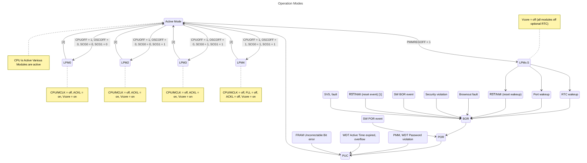

# 1.4 Operating Modes

The MSP430 family is designed for low-power applications and uses the different operating modes shown in
Figure 1-5.

The operating modes take into account three different needs:

- Low power
- Speed and data throughput
- Minimizing current consumption of individual peripherals

Low-power modes LPM0 through LPM4 are configured with the `CPUOFF`, `OSCOFF`, `SCG0`, and `SCG1` bits in the `SR`.
The advantage of including the `CPUOFF`, `OSCOFF`, `SCG0`, and `SCG1` mode-control bits in the `SR` is that the present
operating mode is saved onto the stack during an interrupt service routine. Program flow returns to the previous
operating mode if the saved `SR` value is not altered during the interrupt service routine.
Program flow can be returned to a different operating mode by manipulating the saved `SR` value on the stack inside of
the interrupt service routine.
When setting any of the mode-control bits, the selected operating mode takes effect immediately.
Peripherals operating with any disabled clock are disabled until the clock becomes active. Peripherals may also be
disabled with their individual control register settings.
All I/O port pins, RAM, and registers are unchanged. Wake-up from LPM0 through LPM4 is possible through all enabled
interrupts.

When LPMx.5 (LPM3.5 or LPM4.5) is entered, the voltage regulator of the Power Management Module (PMM) is disabled. All
RAM and register contents are lost.
Although the I/O register contents are lost, the I/O pin states are locked upon LPMx.5 entry. See the
Digital I/O chapter for further details.
Wake-up from LPM4.5 is possible from a power sequence, a R̅S̅T̅ event, or from specific I/O.
Wake-up from LPM3.5 is possible from a power sequence, a R̅S̅T̅ event, an RTC event, an LF crystal fault, or from
specific I/O.

> [!NOTE]
> The TEST/SBWTCK pin is used for interfacing to the development tools through Spy-Bi-Wire.
> When the TEST/SBWTCK pin is high, wake-up times from LPM2 (device specific), LPM3, and LPM4 may be different compared
> to when TEST/SBWTCK is low.
> Pay careful attention to the real-time behavior when exiting from LPM2 (device specific), LPM3, and LPM4 with the
> device connected to a development tool (for example, MSP-FET430UIF). See the PMM chapter for details.

- [1] An enabled reset always restarts the device
- [2] Any enabled interrupt and NMI performs this transition

**Figure 1-5. Operation Modes**

| `SCG1` [1] | `SCG0` | `OSCOFF` [1] | `CPUOFF` [1] | Mode                         | CPU and Clocks Status [2] |
| ---------- | ------ | ------------ | ------------ | ---------------------------- | ------------------------- |
| 0         | 0      | 0           | 0           | Active                       | See details below |
| 0         | 0      | 0           | 1           | LPM0                         | See details below |
| 1         | 0      | 0           | 1           | LPM2 (device specific) | See details below |
| 1         | 1      | 0           | 1           | LPM3                         | See details below |
| 1         | 1      | 1           | 1           | LPM4                         | CPU and all clocks are disabled. |
| 1         | 1      | 1           | 1           | LPM3.5                       | See details below |
| 1         | 1      | 1           | 1           | LPM4.5                       | See details below |

**Detailed Mode Descriptions:**

**Active Mode**: CPU, MCLK are active. ACLK is active. SMCLK optionally active (SMCLKOFF = 0). DCO
is enabled if sources ACLK, MCLK, or SMCLK (SMCLKOFF = 0). DCO bias is enabled if DCO is enabled or
DCO sources MCLK or SMCLK (SMCLKOFF = 0). FLL is enabled if DCO is enabled. CPU, MCLK are disabled.

**LPM0**: ACLK is active. SMCLK optionally active (SMCLKOFF = 0). DCO is enabled if sources ACLK or
SMCLK (SMCLKOFF = 0). DCO bias is enabled if DCO is enabled or DCO sources MCLK or SMCLK
(SMCLKOFF = 0). FLL is enabled if DCO is enabled.

**LPM2** (device specific): CPU, MCLK, and FLL are disabled. ACLK is active. SMCLK is disabled.
FLL is disabled.

**LPM3**: CPU, MCLK, and FLL are disabled. ACLK is active. SMCLK is disabled. FLL is disabled.

**LPM3.5**: When `PMMREGOFF` = 1, regulator is disabled. RAM retention in backup memory. In this
mode, RTC and LCD operation is possible when configured properly. See the RTC and LCD modules for
further details.

**LPM4.5**: When `PMMREGOFF` = 1, regulator is disabled. No memory retention. In this mode, all
clock sources are disabled; that is, no RTC operation is possible.

[1] LPMx.5 modes are entered by following the correct entry sequence as defined in
Section 1.4.2.

[2] The system clocks and the low-power modes can be affected by the clock request system. See the
clock system chapter for details.

**Table 1-2. Operation Modes**
