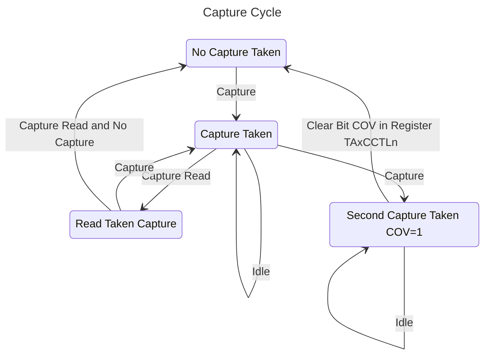

# 13.2.4.1 Capture Mode

The capture mode is selected when CAP = 1. Capture mode is used to record time events. It can be used for speed computations or time measurements. The capture inputs CCIxA and CCIxB are connected to external pins or internal signals and are selected with the CCIS bits. The CM bits select the capture edge of the input signal as rising, falling, or both. A capture occurs on the selected edge of the input signal. If a capture occurs:

- The timer value is copied into the TAxCCRn register.
- The interrupt flag CCIFG is set.

The input signal level can be read at any time through the CCI bit. Devices may have different signals connected to CCIxA and CCIxB. See the device-specific data sheet for the connections of these signals.

> [!NOTE] **Reading TAxCCRn in Capture mode**
> <br>
> In Capture mode, if TAxCCRn is ready by the CPU while the timer counter value is being copied into TAxCCRn at a capture event, the value ready by the CPU could be invalid. To avoid this undesired result, TAxCCRn must be read after the CCIFG flag is set and before the next capture event occurs.

The capture signal can be asynchronous to the timer clock and cause a race condition. Setting the SCS bit synchronizes the capture with the next timer clock. Setting the SCS bit to synchronize the capture signal with the timer clock is recommended (see Figure 13-10).

<a id="figure-13-10"></a>

```text
{signal: [
  {node:                            '.......A..........'},
  {name: 'Timer Clock',       wave: '101010101010101010'},
  {name: 'Timer',             wave: '=.=.=.=.=.=.=.=.=.', data: ["", "n-1", "n-1", "n", "n+1", "n+2", "n+3", "n+4"]},
  {name: 'CCI',               wave: '0.....x1..........'},
  {name: 'Capture',           wave: '0......10.........'},
  {name: 'Set TAxCCR0 CCIFG', wave: '0......0..........'},
  {node:                            '.......B..........'},
],
  edge: [
    'A-B CCIFG set'
  ]
}
```

**Figure 13-10. Capture Signal (SCS = 1)**

> [!NOTE] **Changing Capture Input source (CCIS bits)**
> <br>
> Switching between CCIxA and CCIxB while in capture mode may cause unintended capture events. To avoid this scenario, capture inputs should only be changed when capture mode is disabled (CM = {0} or CAP = 0). Note that switching between GND and VCC can be performed at any time. See Section 13.2.4.1.1 for details.

Overflow logic is provided in each capture/compare register to indicate if a second capture was performed before the value from the first capture was read. Bit COV is set when this occurs as shown in Figure 13-11. COV must be reset with software.

<a id="figure-13-11"></a>



**Figure 13-11. Capture Cycle**
