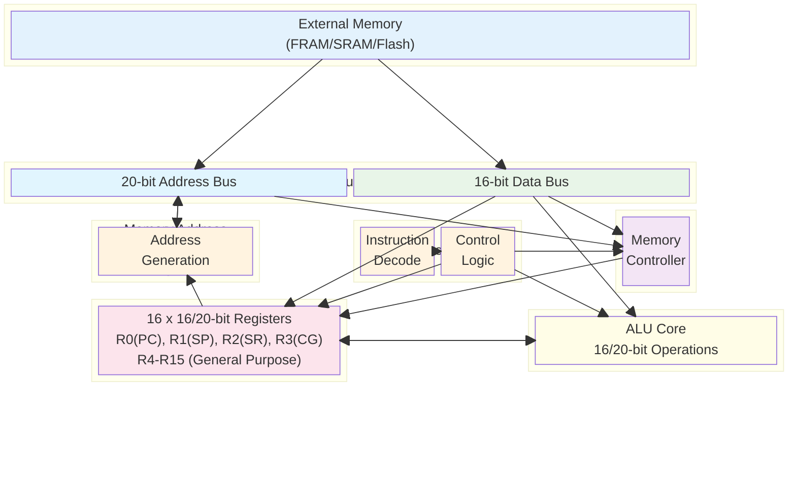

# 4.1 MSP430X CPU (CPUX) Introduction

The MSP430X CPU incorporates features specifically designed for modern programming techniques, such as calculated
branching, table processing, and the use of high-level languages such as C. The MSP430X CPU can address a 1MB
address range without paging. The MSP430X CPU is completely backward compatible with the MSP430 CPU.

The MSP430X CPU features include:

- RISC architecture
- Orthogonal architecture
- Full register access including program counter (PC), status register (SR), and stack pointer (SP)
- Single-cycle register operations
- Large register file reduces fetches to memory.
- 20-bit address bus allows direct access and branching throughout the entire memory range without paging.
- 16-bit data bus allows direct manipulation of word-wide arguments.
- Constant generator provides the six most often used immediate values and reduces code size.
- Direct memory-to-memory transfers without intermediate register holding
- Byte, word, and 20-bit address-word addressing

The block diagram of the MSP430X CPU is shown in Figure 4-1.

## Figure 4-1: MSP430X CPU Block Diagram

**Reference:** MSP430FR2xx FR4xx Family User's Guide (SLAU445I, October 2014–Revised March 2019)  
Section 4.1: "MSP430X CPU (CPUX) Introduction" - Figure 4-1
